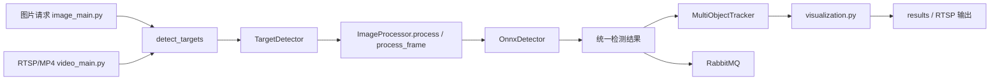

# 智能海上目标识别

面向海上目标场景的检测与跟踪项目，当前仓库主要提供两条链路：

- 图片检测 API：通过 HTTP 上传图片或提交本地路径，执行检测、生成结果图并发送 MQ
- 视频检测：从 RTSP 或本地 MP4 读取视频，逐帧检测、目标跟踪、可视化输出并发送 MQ

当前主实现基于 ONNX Runtime，检测入口统一收敛到 `target_module/image_detect_module/target_detection.py`。

---

## 1. 项目入口

- `image_main.py`：正式图片检测 API 入口
- `video_main.py`：正式视频检测与多目标跟踪入口
- `image_main copy.py`：调试/手工测试副本，不建议作为正式部署入口

---

## 2. 核心能力

- 图片检测 HTTP API，支持文件上传和本地路径
- 图片检测默认启用离散图片跟踪，检测框可能包含 `track_id`
- RTSP / 本地 MP4 视频逐帧检测
- ByteTrack / OC-SORT / BoT-SORT / Dist-Tracker FLIT 多算法跟踪
- 检测框、类别、置信度、跟踪 ID、轨迹线可视化
- RTSP 推流与本地 MP4 保存
- RabbitMQ 检测结果上报

---

## 3. 系统架构

### 3.1 分层结构

1. 入口层
- `image_main.py`：图片检测 HTTP 服务
- `video_main.py`：视频检测、跟踪、推流与落盘

2. 检测引擎层
- `target_module/image_detect_module/target_detection.py`：统一检测入口 `detect_targets(...)`
- `target_module/image_detect_module/image_processor.py`：图片类型判断、检测调度、结果封装
- `target_module/image_detect_module/detectors.py`：`OnnxDetector` 推理与后处理

3. 跟踪引擎层
- `target_module/image_detect_module/utils/tracker.py`：多算法跟踪器统一封装
- `target_module/image_detect_module/utils/dist_tracker.py`：Dist-Tracker FLIT 轻量适配层
- `target_module/image_detect_module/utils/kalman_bbox.py`：Kalman 跟踪基础实现
- `target_module/image_detect_module/utils/gmc.py`：全局运动补偿，供 BoT-SORT 使用

4. 输出与集成层
- `visualization.py`：检测框、类别、ID、轨迹线绘制
- `messaging/mq_publisher.py`：图片/视频检测结果 MQ 发送
- `output_rtsp_video/video_output_manager.py`：RTSP 输出与本地视频保存

### 3.2 数据流



---

## 4. 环境与依赖

### 3.1 运行环境

- Python 3.11+
- Windows / PowerShell
- 可选：RabbitMQ
- 可选：mediamtx（RTSP 服务）
- 可选：FFmpeg

### 3.2 requirements

仓库内依赖文件：`files/requirements.txt`

当前文件中列出的主要依赖包括：

- `numpy`
- `opencv_python`
- `pika`
- `Pillow`
- `psutil`
- `Requests`
- `torch`
- `torchvision`
- `transformers`
- `ultralytics`

### 3.3 额外说明

主服务实际运行还依赖下列组件，若本地环境未安装，需要额外补齐：

- `Flask`
- `Flask-CORS`
- `onnxruntime`
- `pytest`（运行测试时需要）

安装示例：

```powershell
pip install -r files\requirements.txt
pip install flask flask-cors onnxruntime pytest
```

---

## 5. 快速开始

### 4.1 启动图片检测 API

```powershell
python image_main.py
```

默认监听地址：

- `http://0.0.0.0:8080`

### 4.2 启动视频检测

```powershell
# RTSP 模式（默认）
python video_main.py

# 本地 MP4 输入
python video_main.py --input "D:\path\to\video.mp4"

# 指定追踪算法
python video_main.py --input "video.mp4" --tracker ocsort
python video_main.py --input "video.mp4" --tracker dist_tracker

# 自定义输出路径 + 无窗口模式
python video_main.py --input "video.mp4" --output results\out.mp4 --no-display
```

### 4.3 `video_main.py` 参数

| 参数 | 说明 | 默认值 |
|------|------|--------|
| `--input` | 本地视频文件路径；为空时使用 RTSP 输入 | 空 |
| `--tracker` | `bytetrack` / `ocsort` / `botsort` / `dist_tracker` / `official_ocsort` / `official_botsort` | 配置默认值 |
| `--output` | 输出视频路径 | `Config.VIDEO_OUTPUT_PATH`（默认 `results/output.mp4`） |
| `--no-display` | 不显示预览窗口 | 关闭 |

### 4.4 RTSP 默认配置

- 输入：`Config.VIDEO_RTSP_INPUT`（默认 `rtsp://localhost:8554/video`）
- 输出：`Config.VIDEO_RTSP_OUTPUT`（默认 `rtsp://localhost:8554/output`）
- 本地保存：`Config.VIDEO_OUTPUT_PATH`（默认 `results/output.mp4`）

---

## 6. 模型与配置

配置文件：`target_module/image_detect_module/config.py`

### 5.1 当前默认模型

- 可见光模型：`target_module/models/A_S_F_rgb_FFCA.onnx`
- 红外模型：`target_module/models/A_S_F_ir_FFCA.onnx`
- 模型路径由 `Config` 使用跨平台 `os.path.join(...)` 生成，可在 Windows 和 Linux/WSL 下直接解析

### 5.2 当前默认阈值

- 可见光置信度阈值：`0.5`
- 红外置信度阈值：`0.65`
- NMS IoU 阈值：`0.5`

### 5.3 当前默认跟踪配置

- 默认跟踪器：`botsort`
- 可选跟踪器：`bytetrack`、`ocsort`、`botsort`、`dist_tracker`、`official_ocsort`、`official_botsort`
- `dist_tracker` 是 Dist-Tracker 后端跟踪思想的轻量适配层，使用 FLIT 的 L2-IoU 融合匹配代价、检测置信度融合和现有 GMC；不引入 Dist-Tracker 的 YOLO/Ultralytics 检测链路。
- `official_ocsort` / `official_botsort` 是 vendored 官方源码适配层；默认 `botsort` 仍是项目轻量 baseline，`official_botsort` 第一版不启用 ReID。
- `DIST_TRACKER_GAMMA = 0.25`
- `DIST_TRACKER_MATCH_THRESH = 0.8`
- `DIST_TRACKER_FUSE_SCORE = True`
- `IMAGE_TRACKER_MIN_HITS = 1`
- `IMAGE_TRACKER_FRAME_RATE = 1.0`
- `VIDEO_RTSP_INPUT = rtsp://localhost:8554/video`
- `VIDEO_RTSP_OUTPUT = rtsp://localhost:8554/output`
- `VIDEO_OUTPUT_PATH = results/output.mp4`

说明：

- 当前 README 以 `config.py` 里的实际默认值为准
- 目前默认红外模型不是 `A_S_F_ir_FFCA_v2.onnx`

---

## 7. 图片检测 API

### 6.1 接口列表

- `POST /api/v1/detect/image`
- `POST /api/detect/image`：兼容路径
- `GET /api/v1/results/<result_id>`：获取结果图

### 6.2 请求方式

`POST /api/v1/detect/image` 支持两种输入：

1. `multipart/form-data`
- 字段：`file`

2. `application/json`
- 字段：`image_path`

### 6.3 请求示例

上传文件：

```bash
curl -X POST "http://127.0.0.1:8080/api/v1/detect/image" \
  -F "file=@./test.jpg"
```

提交本地路径：

```bash
curl -X POST "http://127.0.0.1:8080/api/v1/detect/image" \
  -H "Content-Type: application/json" \
  -d "{\"image_path\": \"D:/data/test.jpg\"}"
```

### 6.4 当前处理流程

`image_main.py` 当前主流程如下：

1. 接收上传文件或 `image_path`
2. 调用 `td.detect_targets(filepath, "./", enable_tracking=True)`
3. 如 MQ 可用，则发送图片检测结果到 RabbitMQ
4. 生成带标注结果图并保存到 `results/`
5. 将 `result_image_path` 和 `result_id` 回写到检测结果

### 6.5 返回与字段说明

检测引擎返回的标准结构以 `target_detection.py` 为准，典型字段包括：

- `success`
- `message`
- `timestamp`
- `type`
- `data.count`
- `data.boxes`
- `data.result_image_path`

在 `enable_tracking=True` 时，`data.boxes` 中的目标可能包含：

- `track_id`：跟踪 ID
- `id`：兼容字段，等于 `track_id`

示例结构：

```json
{
  "success": true,
  "message": "Success",
  "timestamp": 1753774440304,
  "type": "visible",
  "data": {
    "count": 1,
    "result_image_path": "D:/project/results/result_xxx.jpg",
    "boxes": [
      {
        "x": 120,
        "y": 88,
        "w": 65,
        "h": 44,
        "confidence": 0.91,
        "class": "USV",
        "track_id": 7,
        "id": 7
      }
    ]
  }
}
```

注意：

- 当前 `image_main.py` 的 HTTP 主流程偏向“接收请求并处理/MQ 上报”
- `APIResponse.success(...)` 在现代码里并未完整实现，HTTP 实际返回体不能按 README 中的检测结构做强依赖
- 如需消费完整检测结果，建议以检测模块返回结构或 MQ 消息结构为准

### 6.6 结果图获取

`image_main.py` 当前会将结果图保存为：

- `results/result_<result_id>.jpg`

查询接口：

```text
GET /api/v1/results/<result_id>
```

如果文件存在，将直接返回对应 JPEG 图片。

### 6.7 错误码

- `400`：参数错误、文件不存在、文件类型非法
- `413`：文件过大，默认 100MB
- `503`：检测模块不可用
- `500`：服务内部错误

---

## 8. 视频检测与跟踪

`video_main.py` 支持两种输入方式：

- RTSP 流
- 本地 MP4 文件

当前流程：

1. 打开 RTSP 或本地视频
2. 逐帧写入临时图片供检测器读取
3. 调用 `detect_from_image_file(...)` 执行检测
4. 使用 `MultiObjectTracker` 做多目标跟踪
5. 用 `visualization.py` 绘制检测框、ID 与轨迹
6. 输出到 RTSP 和/或本地 MP4
7. 通过后台队列线程约每 2 秒发送一次 MQ 消息

---

## 9. RabbitMQ 与 RTSP 服务

### 8.1 RabbitMQ

配置文件：`messaging/mq_config.py`

当前默认配置：

- host：`168.1.3.100`
- port：`5672`
- username：`admin`
- password：`admin`
- exchange：`uavExchange`
- 图片队列：`analyzeImageQueue`
- 无人船视频队列：`analyzeVideoQueue1`
- 无人机视频队列：`analyzeVideoQueue2`

本地快速启动示例：

```powershell
docker run -d --name rabbitmq -p 5672:5672 -p 15672:15672 rabbitmq:3-management
```

管理台：

- `http://127.0.0.1:15672`

### 8.2 mediamtx

配置文件：

- `output_rtsp_video/mediamtx/mediamtx.yml`

启动示例：

```powershell
cd output_rtsp_video\mediamtx
.\mediamtx.exe .\mediamtx.yml
```

---

## 10. 常用工具

### 10.1 `onnx_predict_car.py`

离线单图 ONNX 推理验证脚本，用于快速验证模型和后处理逻辑。

### 10.2 `image_main copy.py`

`image_main.py` 的调试副本，包含手工测试模式 `TEST_MODE`。适合本地排查问题，不建议作为正式服务入口。

### 10.3 `tools/validation/video_test_tracking.py`

本地 MP4 跟踪测试脚本，支持低帧率模拟、指定跟踪器和最大处理帧数。

示例：

```powershell
conda run -n ship_detect python tools/validation/video_test_tracking.py --input "D:\path\to\video.mp4"
conda run -n ship_detect python tools/validation/video_test_tracking.py --input "D:\path\to\video.mp4" --tracker botsort --fps-override 5
conda run -n ship_detect python tools/validation/video_test_tracking.py --input "D:\path\to\video.mp4" --tracker dist_tracker --max-frames 100
```

### 10.4 `tools/evaluation/export_mot_results.py`

将某个 tracker 在完整视频上的输出导出为 MOTChallenge tracker result 文件，目录形式为 `<output-root>/<tracker>/data/<seq>.txt`。正式评测时不要使用抽帧或低帧率模式，结果帧号必须与 GT 的 `seqinfo.ini` / `gt/gt.txt` 对齐。

示例：
```powershell
conda run -n ship_detect python tools/evaluation/export_mot_results.py --input "D:\path\to\video.mp4" --tracker official_botsort --seq-name "seq01" --output-root "results\motchallenge_trackers"
conda run -n ship_detect python tools/evaluation/export_mot_results.py --input "D:\path\to\video.mp4" --tracker dist_tracker --seq-name "seq01" --output-root "results\motchallenge_trackers"
```

### 10.5 `tools/evaluation/motchallenge_eval.py`

调用 vendored TrackEval 计算正式 MOTChallenge 风格指标：HOTA、MOTA、IDF1。输入必须包含真实跨帧身份标注，GT 目录结构为 `<gt-root>/<seq>/seqinfo.ini` 和 `<gt-root>/<seq>/gt/gt.txt`。

示例：
```powershell
conda run -n ship_detect python tools/evaluation/motchallenge_eval.py --gt-root "D:\path\to\mot_gt" --trackers-root "results\motchallenge_trackers" --trackers official_botsort --sequences seq01 --output-root "results\motchallenge_eval"
```

### 10.6 `tools/dataset/extract_tracking_frames.py`

批量抽帧脚本，递归扫描 `_V`/`_T` 视频，复用 ONNX 检测与可配置跟踪器（默认 `botsort`），按位移、目标自身姿态角、面积变化和图像相似度导出训练帧、空标签文件与清单 CSV。

示例：
```powershell
conda run -n ship_detect python tools/dataset/extract_tracking_frames.py
conda run -n ship_detect python tools/dataset/extract_tracking_frames.py --input-root "D:\Desktop\烟台项目数据\原始数据集\视频" --output-root "D:\Desktop\烟台项目数据\原始数据集\external_frames" --resume
```

### 10.7 `tools/validation/test_image_tracking_api.py`

验证 `detect_targets(..., enable_tracking=True)` 的跨帧跟踪行为、延迟和回归项。

### 10.8 `tools/validation/tracker_effect_test.py`

对同一组 RGB / IR 视频执行一次检测，并将同一帧检测结果同时喂给多个跟踪器，输出带 `track_id` 的标注视频和逐帧框数据，用于人工对比跟踪效果。

默认输入：

- IR：`/mnt/d/Desktop/UAV_USV标注数据集/multi_target_source_videos/USV/IR/DJI_20250916100639_0001_T.MP4`
- RGB：`/mnt/d/Desktop/UAV_USV标注数据集/multi_target_source_videos/USV/RGB/DJI_20250916100639_0001_V.MP4`

默认输出：

- `results/tracker_effect_test/DJI_20250916100639_0001/IR/<tracker>/`
- `results/tracker_effect_test/DJI_20250916100639_0001/RGB/<tracker>/`

每个 tracker 目录包含：

- `annotated.mp4`
- `annotated_part_*.mp4`（使用 `--resume` 续跑时生成，表示从中断帧之后继续写出的标注视频段）
- `tracks.csv`
- `frames.jsonl`
- `summary.json`
- `error.txt`（仅失败时生成）

示例：

```powershell
conda run -n ship_detect python tools/validation/tracker_effect_test.py --max-frames 5
conda run -n ship_detect python tools/validation/tracker_effect_test.py
conda run -n ship_detect python tools/validation/tracker_effect_test.py --resume
conda run -n ship_detect python tools/validation/tracker_effect_test.py --trackers botsort dist_tracker official_botsort
conda run -n ship_detect python tools/validation/tracker_effect_test.py --modalities IR --trackers dist_tracker --progress-interval 25
```

`--resume` 会读取每个 tracker 目录下已有 `frames.jsonl` 的行数，并只从下一帧开始追加 `frames.jsonl` / `tracks.csv`。由于 MP4 容器不能可靠原地追加，续跑时不会覆盖已有 `annotated.mp4`，而是写入新的 `annotated_part_<起始帧>.mp4`；脚本仍会从视频开头重放已处理帧来恢复各 tracker 的内部状态，但不会重复写出这些帧的数据。

### 10.9 `tools/validation/video_detect_only.py`

对本地视频逐帧执行当前 ONNX 检测模型，只绘制检测框与类别置信度，不初始化跟踪器、不输出 `track_id`。适合快速检查检测模型在外部视频上的召回和误检情况。

示例：

```powershell
conda run -n ship_detect python tools/validation/video_detect_only.py --file-type visible --input "D:\path\video1.mp4" --input "D:\path\video2.mp4" --output-dir results/detection_only
conda run -n ship_detect python tools/validation/video_detect_only.py --file-type visible --input "D:\path\video.mp4" --max-frames 5
conda run -n ship_detect python tools/validation/video_detect_only.py --file-type visible --conf-threshold 0.1 --input "D:\path\video.mp4"
```

每个输入视频会输出：

- `<视频名>_detected.mp4`
- `<视频名>_summary.json`
- `<视频名>_detections.csv`：每个检测框一行，字段为 `frame_index,timestamp_sec,detection_id,x,y,w,h,confidence,class,class_confidence`
- `<视频名>_frames.jsonl`：每帧一行，包含 `frame_index,timestamp_sec,boxes`；无目标帧也写入 `boxes: []`
- `<视频名>_analysis.md`：单视频检测覆盖率、类别、置信度和框面积统计
- `detection_analysis.md`：批量汇总报告

### 10.10 `tools/experiments/run_compare_ir_models.py`

用于比较两版红外模型：

- `A_S_F_ir_FFCA.onnx`
- `A_S_F_ir_FFCA_v2.onnx`

示例：

```powershell
conda run -n ship_detect python tools/experiments/run_compare_ir_models.py
```

输出示例：

- `results/ir_cmp_<视频标签>_<模型标记>.mp4`

---

## 11. 测试

安装：

```powershell
pip install pytest
```

运行：

```powershell
pytest -q
```

仓库中还包含以下测试或验证入口：

- `test/test_extract_tracking_frames.py`
- `test/test_video_dataset_classify.py`
- `tools/validation/test_image_tracking_api.py`
- `output_rtsp_video/test_output_rtsp_video.py`
- `tools/experiments/run_all_tests.py`

说明：

- 部分测试依赖 RTSP、FFmpeg、RabbitMQ 或本地数据文件
- `tools/validation/` 和 `tools/experiments/` 是人工验证/实验脚本，不等同于 pytest 单元测试
- 运行前请先确认外部服务和测试数据已准备好

---

## 12. 目录速览

- `image_main.py`：图片检测 API
- `image_main copy.py`：图片检测调试副本
- `video_main.py`：视频检测与跟踪入口
- `visualization.py`：可视化绘制
- `tools/README.md`：离线工具目录说明
- `tools/dataset/`：数据集整理、抽帧、批量分析和 YOLO 标签可视化工具
- `tools/validation/`：人工验证、调试和本地效果检查脚本
- `tools/experiments/`：跟踪器、模型和帧率实验编排脚本
- `target_module/`：检测核心模块与模型
- `messaging/`：RabbitMQ 配置与发布
- `output_rtsp_video/`：RTSP 输出与推流管理
- `results/`：结果图与输出视频目录
- `uploads/`：上传文件临时目录

---

## 12.5 Dataset Batch Classification

新增 `tools/dataset/video_dataset_classify.py` 作为目录级离线批处理入口，用于对 `_V` / `_T` 视频做全量解码、时间窗场景分类、目标统计、双模态校准和报表导出。

### Command

```powershell
conda run -n ship_detect python tools/dataset/video_dataset_classify.py
conda run -n ship_detect python tools/dataset/video_dataset_classify.py --input-root "D:\Desktop\烟台项目数据\原始数据集\视频"
conda run -n ship_detect python tools/dataset/video_dataset_classify.py --input-root "D:\Desktop\烟台项目数据\原始数据集\视频" --resume
conda run -n ship_detect python tools/dataset/video_dataset_classify.py --input-root "D:\Desktop\烟台项目数据\原始数据集\视频" --resume --workers 2
```

### Key Config

配置位于 `target_module/image_detect_module/config.py`，新增：

- `DATASET_INPUT_ROOT`
- `DATASET_OUTPUT_ROOT`
- `DATASET_MAX_WORKERS`
- `DATASET_WINDOW_SECONDS`
- `DATASET_MIN_FRAMES_PER_WINDOW`
- `DATASET_LOW_FPS_WINDOW_MAX_SECONDS`
- `DATASET_SCENE_SKY_THRESHOLD`
- `DATASET_SCENE_SHORELINE_LOW_THRESHOLD`
- `DATASET_SCENE_SHORELINE_HIGH_THRESHOLD`
- `DATASET_T_SCENE_DOMINANT_RATIO_MIN`
- `DATASET_T_SCENE_MIN_INTENSITY_VARIANCE`
- `DATASET_T_SCENE_MIN_HORIZON_CONFIDENCE`
- `DATASET_T_SCALE_DEFAULT`
- `DATASET_T_CALIB_MIN_OVERLAP_COUNT`
- `DATASET_ALIGNMENT_MIN_OVERLAP_RATIO`
- `DATASET_USABLE_WINDOW_RATIO_THRESHOLD`
- `DATASET_MAX_CONSECUTIVE_UNUSABLE_WINDOWS`

### Scene Rules

- 场景类别固定为 `pure_sea`、`pure_sky`、`nearshore_sea`、`sea_sky`、`nearshore_sea_sky`、`shoreline_mixed`
- 场景优先级固定为 `shoreline_mixed > nearshore_sea_sky > nearshore_sea > sea_sky > pure_sea > pure_sky`
- `_V` 使用颜色、亮度、边缘、地平线等可见光启发式特征
- `_T` 使用亮度分层、局部对比、边界复杂度、水平分界稳定性和纹理粗糙度等红外适配特征，不使用颜色/饱和度作为主特征
- `_T` 低置信度显式触发条件：
  - `max(sea_ratio, sky_ratio, shoreline_land_ratio) < DATASET_T_SCENE_DOMINANT_RATIO_MIN`
  - `frame_intensity_variance < DATASET_T_SCENE_MIN_INTENSITY_VARIANCE`
  - `horizon_confidence < DATASET_T_SCENE_MIN_HORIZON_CONFIDENCE` 且 `shoreline_land_ratio` 落在近岸区间
- 若 `paired` 单元中 `_T` 低置信度且存在满足重叠条件的 `_V` 同窗结果，则 `primary_scene` 使用 `_V` 结果并将 `scene_source` 标记为 `paired_visible_proxy`

### Usable Rules

- 时间窗级 `usable=false` 条件：
  - `frame_count < 4`
  - `scene_classification_failed=true`
  - `detector_not_run=true`
  - `decode_error=true`
- 视频级只有同时满足以下条件才为 `usable=true`
  - `usable_window_ratio >= DATASET_USABLE_WINDOW_RATIO_THRESHOLD`
  - `max_consecutive_unusable_windows <= DATASET_MAX_CONSECUTIVE_UNUSABLE_WINDOWS`

### Outputs

默认输出到 `results/video_dataset_analysis/<run_id>/`，包含：

- `precheck_by_date.csv`
- `window_results.csv`
- `video_results.csv`
- `report_all_units.csv`
- `report_paired_only.csv`
- `gap_report.csv`
- `run_summary.json`

`window_results.csv` 固定列：

- `unit_id`
- `date_batch`
- `modality`
- `pair_status`
- `window_start`
- `window_end`
- `frame_count`
- `low_fps_window`
- `duration_from_metadata`
- `decode_error`
- `primary_scene`
- `sea_ratio`
- `sky_ratio`
- `shoreline_land_ratio`
- `scene_classification_failed`
- `scene_classification_low_confidence`
- `scene_source`
- `target_presence`
- `target_count`
- `track_count`
- `bbox_area_ratio_stats`
- `scale_bin_counts`
- `small_target_count`
- `detector_not_run`
- `usable`

## 13. Changelog

### 2026-05-30

- `feat`: 新增 `dist_tracker` 跟踪器，按 Dist-Tracker/FLIT 思路实现 L2-IoU 融合匹配、检测置信度融合和 GMC，保持项目检测框输入输出契约
- `feat`: `video_main.py`、`video_test_tracking.py`、`export_mot_results.py` 和 `extract_tracking_frames.py` 支持 `--tracker dist_tracker`
- `feat`: 新增 `tools/validation/tracker_effect_test.py`，同一帧检测结果可同时喂给多个跟踪器并输出标注视频、`tracks.csv`、`frames.jsonl` 和 `summary.json`
- `feat`: 新增 `tools/validation/video_detect_only.py`，用于本地视频纯检测可视化与检测统计导出，不初始化跟踪器
- `refactor`: ONNX 模型默认路径改为基于 `Config.BASE_DIR` 和 `os.path.join(...)` 构造，避免 Windows 路径分隔符在 Linux/WSL 下失效
- `test`: 新增 `dist_tracker` 合成检测框单元测试、tracker effect 导出 helper 测试和默认模型路径测试
- `docs`: README、抽帧说明和 AGENTS 规则同步更新，明确 Dist-Tracker 配置、工具用法和修改代码后更新 README 的要求

### 2026-04-23

- `refactor`: 将 `video_main.py` 的 RTSP 输入、RTSP 输出和默认输出视频路径迁移到 `Config`
- `feat`: 新增 `tools/dataset/video_dataset_classify.py`，支持递归遍历 `_V` / `_T` 视频，输出预检查、时间窗级结果、视频级汇总和缺口报表
- `feat`: `config.py` 新增数据集批处理配置，包括时间窗退化、红外低置信度规则、双模态重叠对齐、`usable` 阈值和 `T` 小目标校准参数
- `test`: 新增 `test/test_video_dataset_classify.py`，覆盖场景分类、低置信度、窗口退化、重叠对齐、`usable` 规则和汇总字段
- `docs`: README 补充离线批处理入口、输出文件、窗口级列定义与规则说明

### 2026-04-16

- `feat`: 新增 `tools/dataset/extract_tracking_frames.py`，支持递归遍历 `_V`/`_T` 视频、基于检测/跟踪事件抽帧、导出 YOLO 标签与训练清单
- `feat`: `ImageProcessor` 新增 `process_frame(frame, file_type)`，支持内存帧直接推理
- `fix`: `detectors.py` 放宽对 `torch` 的依赖，缺少 `torch` 时仍可导入并使用 ONNX Runtime

### 2026-03-31

- `feat`: `video_main.py` 集成多目标跟踪器，支持 `ByteTrack`、`OC-SORT`、`BoT-SORT`
- `feat`: `video_main.py` 新增本地 MP4 输入模式和 `--input`、`--tracker`、`--output`、`--no-display` 参数
- `fix`: MQ 发送改为队列 + 后台线程，避免逐帧创建线程
- `refactor`: 视频检测入口重构为 `argparse + main()` 形式

### 2026-03-30

- `feat`: 增加 `tracker.py`、`kalman_bbox.py`、`gmc.py`，形成多算法跟踪基础能力
- `feat`: 增加 `tools/validation/video_test_tracking.py`、`tools/experiments/run_all_tests.py`
- `refactor`: 调整配置与可视化逻辑，强化低帧率场景下的跟踪验证能力

### 2026-03-27

- `feat`: 检测结果图路径回写到返回结果
- `fix`: 修复 Windows 中文路径下图片读写问题
- `fix`: 修正目标类别与图片类型识别相关问题

---
