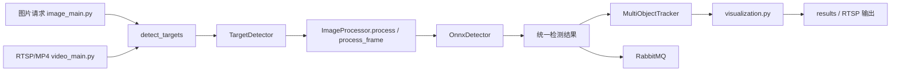

# 智能海上目标识别

面向海上目标场景的检测与跟踪项目，当前仓库主要提供两条链路：

- 图片检测 API：通过 HTTP 上传图片或提交本地路径，执行检测、生成结果图并发送 MQ
- 视频检测：从 RTSP 或本地 MP4 读取视频，逐帧检测、目标跟踪、可视化输出并发送 MQ

当前主实现基于 ONNX Runtime，检测入口统一收敛到 `target_module/image_detect_module/target_detection.py`。

---

## 1. 项目入口

- `image_main.py`：正式图片检测 API 入口
- `video_main.py`：正式视频检测与多目标跟踪入口
- `image_main copy.py`：调试/手工测试副本，不建议作为正式部署入口

---

## 2. 核心能力

- 图片检测 HTTP API，支持文件上传和本地路径
- 图片检测默认启用离散图片跟踪，检测框可能包含 `track_id`
- RTSP / 本地 MP4 视频逐帧检测
- ByteTrack / OC-SORT / BoT-SORT / Dist-Tracker FLIT 多算法跟踪
- 检测框、类别、置信度、跟踪 ID、轨迹线可视化
- RTSP 推流与本地 MP4 保存
- RabbitMQ 检测结果上报

---

## 3. 系统架构

### 3.1 分层结构

1. 入口层
- `image_main.py`：图片检测 HTTP 服务
- `video_main.py`：视频检测、跟踪、推流与落盘

2. 检测引擎层
- `target_module/image_detect_module/target_detection.py`：统一检测入口 `detect_targets(...)`
- `target_module/image_detect_module/image_processor.py`：图片类型判断、检测调度、结果封装
- `target_module/image_detect_module/detectors.py`：`OnnxDetector` 推理与后处理

3. 跟踪引擎层
- `target_module/image_detect_module/utils/tracker.py`：多算法跟踪器统一封装
- `target_module/image_detect_module/utils/dist_tracker.py`：Dist-Tracker FLIT 轻量适配层
- `target_module/image_detect_module/utils/kalman_bbox.py`：Kalman 跟踪基础实现
- `target_module/image_detect_module/utils/gmc.py`：全局运动补偿，供 BoT-SORT 使用
- `target_module/image_detect_module/utils/motion_seed.py`：MS-DC-ELT 运动种子生成调试模块，不接入 baseline tracker；连通域分数使用一次性聚合，避免 4K 视频逐连通域构造整帧 mask
- `target_module/image_detect_module/utils/msdc_types.py`：MS-DC-ELT 生命周期核心数据结构与输出转换 helper
- `target_module/image_detect_module/utils/evidence_state.py`：MS-DC-ELT-lite 证据积分和基础生命周期状态机，当前不接入 baseline tracker；removed guard 使用每帧签名缓存和向量化几何计算以支持长视频评测
- `target_module/image_detect_module/utils/msdc_detection.py`：MS-DC-ELT high/low 检测公共 runtime helper，供 `video_main.py`、MOT 导出、直接渲染和测速脚本复用
- `target_module/image_detect_module/utils/lifecycle_tracker.py`：MS-DC-ELT-lite 最小 tracker 主类，串联 high/low/motion observation 与 evidence state，可通过 `video_main.py --tracker msdc_elt` 独立启用
- `target_module/image_detect_module/utils/template_lock.py`：MS-DC-ELT active-only 轻量模板锁定，基于局部 OpenCV NCC，不对 candidate 启动模板
- `target_module/image_detect_module/utils/roi_redetect.py`：MS-DC-ELT 轨迹驱动 ROI 低阈值重检，只服务 active/lost track 的漏检诊断与重捕，不对 candidate 无界扩张

4. 输出与集成层
- `visualization.py`：检测框、类别、ID、轨迹线绘制
- `messaging/mq_publisher.py`：图片/视频检测结果 MQ 发送
- `output_rtsp_video/video_output_manager.py`：RTSP 输出与本地视频保存

### 3.2 数据流



---

## 4. 环境与依赖

### 3.1 运行环境

- Python 3.11+
- Windows / PowerShell
- 可选：RabbitMQ
- 可选：mediamtx（RTSP 服务）
- 可选：FFmpeg

### 3.2 requirements

仓库内依赖文件：`files/requirements.txt`

当前文件中列出的主要依赖包括：

- `numpy`
- `opencv_python`
- `pika`
- `Pillow`
- `psutil`
- `Requests`
- `torch`
- `torchvision`
- `transformers`
- `ultralytics`

### 3.3 额外说明

主服务实际运行还依赖下列组件，若本地环境未安装，需要额外补齐：

- `Flask`
- `Flask-CORS`
- `onnxruntime`
- `pytest`（运行测试时需要）

安装示例：

```powershell
pip install -r files\requirements.txt
pip install flask flask-cors onnxruntime pytest
```

---

## 5. 快速开始

### 4.1 启动图片检测 API

```powershell
python image_main.py
```

默认监听地址：

- `http://0.0.0.0:8080`

### 4.2 启动视频检测

```powershell
# RTSP 模式（默认）
python video_main.py

# 本地 MP4 输入
python video_main.py --input "D:\path\to\video.mp4"

# 指定追踪算法
python video_main.py --input "video.mp4" --tracker ocsort
python video_main.py --input "video.mp4" --tracker dist_tracker
python video_main.py --input "video.mp4" --tracker msdc_elt --no-display

# 自定义输出路径 + 无窗口模式
python video_main.py --input "video.mp4" --output results\out.mp4 --no-display
```

### 4.3 `video_main.py` 参数

| 参数 | 说明 | 默认值 |
|------|------|--------|
| `--input` | 本地视频文件路径；为空时使用 RTSP 输入 | 空 |
| `--tracker` | `bytetrack` / `ocsort` / `botsort` / `dist_tracker` / `official_ocsort` / `official_botsort` / `msdc_elt` | 配置默认值 |
| `--output` | 输出视频路径 | `Config.VIDEO_OUTPUT_PATH`（默认 `results/output.mp4`） |
| `--no-display` | 不显示预览窗口 | 关闭 |

### 4.4 RTSP 默认配置

- 输入：`Config.VIDEO_RTSP_INPUT`（默认 `rtsp://localhost:8554/video`）
- 输出：`Config.VIDEO_RTSP_OUTPUT`（默认 `rtsp://localhost:8554/output`）
- 本地保存：`Config.VIDEO_OUTPUT_PATH`（默认 `results/output.mp4`）

---

## 6. 模型与配置

配置文件：`target_module/image_detect_module/config.py`

### 5.1 当前默认模型

- 可见光模型：`target_module/models/A_S_F_rgb_FFCA.onnx`
- 红外模型：`target_module/models/A_S_F_ir_FFCA.onnx`
- 附加模型：`target_module/models/yolov5n.onnx`，用于轻量 YOLOv5n ONNX 兼容性或实验验证；当前默认检测链路仍使用上述 FFCA ONNX 模型
- 模型路径由 `Config` 使用跨平台 `os.path.join(...)` 生成，可在 Windows 和 Linux/WSL 下直接解析

### 5.2 当前默认阈值

- 可见光置信度阈值：`0.5`
- 红外置信度阈值：`0.65`
- NMS IoU 阈值：`0.5`
- MS-DC-ELT 低阈值检测调试默认关闭：`MSDC_DEBUG_LOW_DET = False`
- MS-DC-ELT 可见光低阈值：`MSDC_LOW_CONF_VISIBLE = 0.18`
- MS-DC-ELT 红外低阈值：`MSDC_LOW_CONF_INFRARED = 0.22`
- MS-DC-ELT low-only 过滤 IoU 阈值：`MSDC_LOW_HIGH_IOU_THRESH = 0.5`
- MS-DC-ELT 低阈值调试默认输出根目录：`MSDC_DEBUG_LOW_DET_OUTPUT_DIR = results/msdc_debug`
- MS-DC-ELT 运动种子默认开启：`MSDC_MOTION_ENABLE = True`
- MS-DC-ELT 运动种子默认使用 GMC：`MSDC_MOTION_USE_GMC = True`
- MS-DC-ELT 运动帧差阈值 percentile：`MSDC_MOTION_DIFF_PERCENTILE = 97`
- MS-DC-ELT 运动连通域面积比例范围：`MSDC_MOTION_MIN_AREA_RATIO = 1e-6`、`MSDC_MOTION_MAX_AREA_RATIO = 0.02`
- MS-DC-ELT 每帧运动框上限：`MSDC_MOTION_MAX_BOXES = 32`
- MS-DC-ELT 运动海面 clutter 限流：`MSDC_MOTION_CLUTTER_COMPONENT_THRESH = 512`，`MSDC_MOTION_CLUTTER_MAX_BOXES = 12`，`MSDC_MOTION_MIN_BOX_SIZE = 4`；当浪花/波纹导致连通域爆炸时，motion 仅保留少量高分候选作为辅助证据
- MS-DC-ELT 运动种子 debug 默认关闭：`MSDC_MOTION_DEBUG = False`
- MS-DC-ELT 运动种子 debug 默认输出根目录：`MSDC_MOTION_DEBUG_OUTPUT_DIR = outputs/msdc_debug`
- MS-DC-ELT 主链路默认关闭：`MSDC_ENABLE = False`
- MS-DC-ELT 消融开关：`MSDC_USE_LOW_DET = True`，`MSDC_USE_MOTION = False`，`MSDC_USE_TEMPLATE = False`，`MSDC_USE_REACQUIRE = True`，`MSDC_USE_ROI_REDETECT = False`，`MSDC_REUSE_GUARD_ENABLE = True`
- MS-DC-ELT 正式默认配置采用 `v3_candidate_topk_no_roi_no_motion`：共享 high/low 检测、关闭 ROI 重检、关闭 template、关闭 motion seed、低阈值候选池 `topK=32` 且 `min_conf=0.25`
- MS-DC-ELT 默认检测加速：`MSDC_EXPORT_SHARE_LOW_HIGH_DET = True`；`msdc_elt` 正式运行和导出路径默认只跑一次低阈值检测，再按默认阈值切分 high boxes，baseline tracker 不使用该分支；如需复现实验旧路径，可设置环境变量 `MSDC_EXPORT_SHARE_LOW_HIGH_DET=0` 恢复 high/low 双次全图检测；MOT 结果按帧流式写入，长视频导出时可用 `--progress-interval N` 定期打印进度并 flush 结果文件
- MS-DC-ELT 默认只输出 active：`MSDC_OUTPUT_CANDIDATES = False`
- MS-DC-ELT lifecycle debug JSONL 默认关闭：`MSDC_DEBUG_EVENTS = False`；长视频评测时每帧 debug 只保留非 removed 轨迹快照，快照上限 `MSDC_DEBUG_TRACK_SNAPSHOT_LIMIT = 128`，细节列表上限 `MSDC_DEBUG_DETAIL_LIMIT = 8`
- MS-DC-ELT lifecycle debug 默认输出目录：`MSDC_LIFECYCLE_DEBUG_OUTPUT_DIR = outputs/msdc_debug`
- MS-DC-ELT evidence score：`MSDC_EVIDENCE_ALPHA = 0.85`，`MSDC_WEIGHT_HIGH = 1.3`，`MSDC_WEIGHT_LOW = 1.0`，`MSDC_WEIGHT_ROI_LOW = 1.0`，`MSDC_WEIGHT_MOTION = 0.6`，`MSDC_WEIGHT_TEMPLATE = 0.4`，`MSDC_NEGATIVE_WEIGHT = 0.5`
- MS-DC-ELT 生命周期阈值：`MSDC_CONFIRM_SCORE = 2.5`，`MSDC_CONFIRM_MIN_HITS = 4`，`MSDC_PRUNE_SCORE = 0.1`，`MSDC_CANDIDATE_MAX_AGE = 5`
- MS-DC-ELT 候选确认检测门控：`MSDC_CONFIRM_REQUIRE_DET = True`，`MSDC_CONFIRM_MIN_REAL_DET_HITS = 4`，`MSDC_CONFIRM_REQUIRE_HIGH_DET = True`，`MSDC_CONFIRM_ALLOW_MOTION_ONLY = False`；motion/template 只能作为辅助证据，不能单独起轨或确认 active
- MS-DC-ELT 低阈值受约束确认：`MSDC_LOW_CANDIDATE_ENABLE = True`，`MSDC_LOW_SPAWN_MIN_CONF = 0.30`，`MSDC_LOW_CONFIRM_MIN_HITS = 5`，`MSDC_LOW_CONFIRM_WINDOW = 8`，`MSDC_LOW_CONFIRM_MIN_AVG_SCORE = 0.22`，`MSDC_LOW_CONFIRM_MAX_MISSES = 1`，`MSDC_LOW_CONFIRM_MAX_AREA_CHANGE = 1.8`，`MSDC_LOW_CONFIRM_MAX_CENTER_STEP_FACTOR = 3.0`；low-only 新目标先进入 hidden `low_candidate`，通过 M-of-N 和稳定性门控后才确认 active
- MS-DC-ELT low-candidate ID 继承：`MSDC_LOW_INHERIT_ENABLE = True`，`MSDC_LOW_INHERIT_SCORE = 0.40`，`MSDC_LOW_INHERIT_IOU_THRESH = 0.02`，`MSDC_LOW_INHERIT_CENTER_DIST = 220.0`，`MSDC_LOW_INHERIT_MAX_LOST_AGE = 120`，`MSDC_LOW_INHERIT_USE_HISTORY_VELOCITY = True`，`MSDC_LOW_INHERIT_MAX_PREDICT_AGE = 120`，`MSDC_LOW_INHERIT_MOTION_MIN = 0.15`，`MSDC_LOW_INHERIT_CLASS_MATCH = True`，`MSDC_LOW_INHERIT_CLASS_MISMATCH_CENTER_DIST = 80.0`，`MSDC_LOW_INHERIT_CLASS_MISMATCH_PENALTY = 0.0`；稳定 low-candidate 确认前会优先接到 nearby lost track 并继承其 `public_id`，lost 预测优先使用低阈值历史的稳健中位速度，类别不一致时不再硬拒绝但要求更近，失败后才允许生成新公开 ID
- MS-DC-ELT 丢失与重捕阈值：`MSDC_ACTIVE_MISSING_PATIENCE = 2`，`MSDC_ACTIVE_SUPPORTED_MISSING_PATIENCE = 6`，`MSDC_ACTIVE_SUPPORT_RECENT_REAL_WINDOW = 8`，`MSDC_ACTIVE_SUPPORT_MIN_AUX_SCORE = 0.2`，`MSDC_LOST_MAX_AGE = 40`，`MSDC_REACQUIRE_INTERVAL = 5`，`MSDC_REACQUIRE_SCORE = 1.5`，`MSDC_REACQUIRE_CENTER_SCALE_FACTOR = 4.0`，`MSDC_REACQUIRE_MAX_CENTER_DIST = 240.0`；近期有 low/roi-low 真实证据且当前仍有 template/motion 辅助支持时，active 可短时间延迟转 lost
- MS-DC-ELT lifecycle 加速默认上限：`MSDC_MAX_ACTIVE_TRACKS = 64`，`MSDC_MAX_LOST_TRACKS = 32`，`MSDC_MAX_CANDIDATES = 32`，`MSDC_MAX_LOW_CANDIDATES = 24`，`MSDC_MAX_TOTAL_TRACKS = 128`，`MSDC_REMOVED_GUARD_FRAMES = 80`；超出上限时优先保留高 evidence、最近更新的轨迹，并更快清理 lost/removed 状态池
- MS-DC-ELT low-only 几何门控默认开启：`MSDC_LOW_OBS_REQUIRE_TRACK_PROXIMITY = True`，`MSDC_LOW_OBS_MOTION_GATE_CENTER_DIST = 240.0`，`MSDC_LOW_OBS_MOTION_GATE_IOU = 0.01`；已有 active/lost 时，超出预测框运动/几何门控的低阈值候选会直接丢弃，避免远处低分噪声扩大 candidate 池；首帧或无 active/lost 时仍允许 low-only 按 `topK/min_conf` 起候选
- `tools/evaluation/msdc_speed_benchmark.py` 会在 `speed_results.csv` 和 `speed_timings.jsonl` 中输出 MS-DC 内部耗时：low-only filter、ROI、motion、observation build、template match/sync、evidence update、output 和 debug，用于定位 tracker/lifecycle 内部瓶颈
- MS-DC-ELT ROI 重检：`MSDC_USE_ROI_REDETECT = False`，`MSDC_ROI_REDETECT_LOW_CONF = 0.12`，`MSDC_ROI_REDETECT_ACTIVE_ENABLE = False`，`MSDC_ROI_REDETECT_ACTIVE_INTERVAL = 8`，`MSDC_ROI_REDETECT_LOST_INTERVAL = 3`，`MSDC_ROI_REDETECT_MAX_TRACKS = 2`，`MSDC_ROI_REDETECT_SEARCH_SCALE = 4.0`，`MSDC_ROI_REDETECT_UPSCALE = 2.0`，`MSDC_ROI_REDETECT_EXISTING_IOU = 0.5`，`MSDC_ROI_REDETECT_MIN_BOX_SIZE = 8`，`MSDC_ROI_REDETECT_MAX_BOXES_PER_ROI = 1`，`MSDC_ROI_REDETECT_LOST_MAX_REAL_AGE = 30`，`MSDC_ROI_REDETECT_COOLDOWN_FRAMES = 3`；需要复现 ROI 消融时可通过环境变量重新开启
- MS-DC-ELT low-only observation 预算：`MSDC_LOW_OBS_TOPK = 32`，`MSDC_LOW_OBS_GLOBAL_TOPK = 32`，`MSDC_LOW_OBS_PER_TRACK_NEAREST = 1`，`MSDC_LOW_OBS_MAX_PER_FRAME = 64`，`MSDC_LOW_OBS_MIN_CONF = 0.25`；默认先用全局 confidence topK 控 FP，再为每条 active/lost prediction 额外保留最近的 gated low det，最后用每帧上限兜底
- MS-DC-ELT removed guard：`MSDC_REUSE_GUARD_ENABLE = True`，`MSDC_REMOVED_GUARD_FRAMES = 120`，`MSDC_removed_GUARD_FRAMES = 120`，`MSDC_REMOVED_GUARD_IOU_THRESH = 0.3`，`MSDC_REMOVED_GUARD_CENTER_DIST = 80.0`
- MS-DC-ELT evidence 关联阈值：`MSDC_ASSOC_IOU_THRESH = 0.2`，`MSDC_ASSOC_CENTER_DIST = 80.0`，`MSDC_OBS_MERGE_IOU_THRESH = 0.5`
- MS-DC-ELT active 近邻候选抑制：`MSDC_SPAWN_SUPPRESS_ENABLE = True`，`MSDC_SPAWN_SUPPRESS_IOU = 0.1`，`MSDC_SPAWN_SUPPRESS_CENTER_DIST = 80.0`，`MSDC_LOW_SPAWN_SUPPRESS_CENTER_DIST = 120.0`；low-only 候选靠近 active track 时使用更宽 suppression，避免浪花/重复低阈值框确认成新公开 ID
- MS-DC-ELT 输出去重与过滤：`MSDC_OUTPUT_NMS_ENABLE = True`，`MSDC_OUTPUT_NMS_IOU = 0.3`，`MSDC_OUTPUT_NMS_CENTER_DIST = 60.0`，`MSDC_OUTPUT_NMS_FRAGMENT_AREA_RATIO = 0.35`，`MSDC_OUTPUT_NMS_CONTAINMENT_RATIO = 0.50`，`MSDC_OUTPUT_MAX_REAL_DET_AGE = 3`，`MSDC_OUTPUT_MIN_BOX_SIZE = 12`
- MS-DC-ELT active-only TemplateLock formal 默认关闭：`MSDC_TEMPLATE_ENABLE = False`，`MSDC_TEMPLATE_AUX_ONLY = True`，`MSDC_TEMPLATE_UPDATE_REQUIRE_REAL_DET = True`，`MSDC_MAX_ACTIVE_TEMPLATES = 8`，`MSDC_TEMPLATE_UPDATE_THRESH = 0.75`，`MSDC_TEMPLATE_SEARCH_SCALE = 2.5`，`MSDC_TEMPLATE_MIN_SIZE = 8`；如需消融复现模板模块，可设置 `MSDC_USE_TEMPLATE=1` 与 `MSDC_TEMPLATE_ENABLE=1`

### 5.3 当前默认跟踪配置

- 默认跟踪器：`botsort`
- 可选跟踪器：`bytetrack`、`ocsort`、`botsort`、`dist_tracker`、`official_ocsort`、`official_botsort`、`msdc_elt`
- `dist_tracker` 是 Dist-Tracker 后端跟踪思想的轻量适配层，使用 FLIT 的 L2-IoU 融合匹配代价、检测置信度融合和现有 GMC；不引入 Dist-Tracker 的 YOLO/Ultralytics 检测链路。
- `official_ocsort` / `official_botsort` 是 vendored 官方源码适配层；默认 `botsort` 仍是项目轻量 baseline，`official_botsort` 第一版不启用 ReID。
- `msdc_elt` 是独立 MS-DC-ELT-lite 分支，仅在显式选择时启用低阈值检测、motion seed 和 lifecycle tracker；不选择该 tracker 时不会触发低阈值检测或 lifecycle debug 输出。
- `DIST_TRACKER_GAMMA = 0.25`
- `DIST_TRACKER_MATCH_THRESH = 0.8`
- `DIST_TRACKER_FUSE_SCORE = True`
- `IMAGE_TRACKER_MIN_HITS = 1`
- `IMAGE_TRACKER_FRAME_RATE = 1.0`
- `VIDEO_RTSP_INPUT = rtsp://localhost:8554/video`
- `VIDEO_RTSP_OUTPUT = rtsp://localhost:8554/output`
- `VIDEO_OUTPUT_PATH = results/output.mp4`

说明：

- 当前 README 以 `config.py` 里的实际默认值为准
- 目前默认红外模型不是 `A_S_F_ir_FFCA_v2.onnx`

---

## 7. 图片检测 API

### 6.1 接口列表

- `POST /api/v1/detect/image`
- `POST /api/detect/image`：兼容路径
- `GET /api/v1/results/<result_id>`：获取结果图

### 6.2 请求方式

`POST /api/v1/detect/image` 支持两种输入：

1. `multipart/form-data`
- 字段：`file`

2. `application/json`
- 字段：`image_path`

### 6.3 请求示例

上传文件：

```bash
curl -X POST "http://127.0.0.1:8080/api/v1/detect/image" \
  -F "file=@./test.jpg"
```

提交本地路径：

```bash
curl -X POST "http://127.0.0.1:8080/api/v1/detect/image" \
  -H "Content-Type: application/json" \
  -d "{\"image_path\": \"D:/data/test.jpg\"}"
```

### 6.4 当前处理流程

`image_main.py` 当前主流程如下：

1. 接收上传文件或 `image_path`
2. 调用 `td.detect_targets(filepath, "./", enable_tracking=True)`
3. 如 MQ 可用，则发送图片检测结果到 RabbitMQ
4. 生成带标注结果图并保存到 `results/`
5. 将 `result_image_path` 和 `result_id` 回写到检测结果

### 6.5 返回与字段说明

检测引擎返回的标准结构以 `target_detection.py` 为准，典型字段包括：

- `success`
- `message`
- `timestamp`
- `type`
- `data.count`
- `data.boxes`
- `data.result_image_path`

在 `enable_tracking=True` 时，`data.boxes` 中的目标可能包含：

- `track_id`：跟踪 ID
- `id`：兼容字段，等于 `track_id`

示例结构：

```json
{
  "success": true,
  "message": "Success",
  "timestamp": 1753774440304,
  "type": "visible",
  "data": {
    "count": 1,
    "result_image_path": "D:/project/results/result_xxx.jpg",
    "boxes": [
      {
        "x": 120,
        "y": 88,
        "w": 65,
        "h": 44,
        "confidence": 0.91,
        "class": "USV",
        "track_id": 7,
        "id": 7
      }
    ]
  }
}
```

注意：

- 当前 `image_main.py` 的 HTTP 主流程偏向“接收请求并处理/MQ 上报”
- `APIResponse.success(...)` 在现代码里并未完整实现，HTTP 实际返回体不能按 README 中的检测结构做强依赖
- 如需消费完整检测结果，建议以检测模块返回结构或 MQ 消息结构为准

### 6.6 结果图获取

`image_main.py` 当前会将结果图保存为：

- `results/result_<result_id>.jpg`

查询接口：

```text
GET /api/v1/results/<result_id>
```

如果文件存在，将直接返回对应 JPEG 图片。

### 6.7 错误码

- `400`：参数错误、文件不存在、文件类型非法
- `413`：文件过大，默认 100MB
- `503`：检测模块不可用
- `500`：服务内部错误

---

## 8. 视频检测与跟踪

`video_main.py` 支持两种输入方式：

- RTSP 流
- 本地 MP4 文件

当前流程：

1. 打开 RTSP 或本地视频
2. 逐帧写入临时图片供检测器读取
3. 调用 `detect_from_image_file(...)` 执行检测
4. 默认使用 `MultiObjectTracker` 做多目标跟踪；仅当 `--tracker msdc_elt` 时，额外调用 `process_frame(..., conf_override=...)` 获取低阈值检测并进入 `MSDCLifecycleTracker`
5. 用 `visualization.py` 绘制检测框、ID 与轨迹
6. 输出到 RTSP 和/或本地 MP4
7. 通过后台队列线程约每 2 秒发送一次 MQ 消息

---

## 9. RabbitMQ 与 RTSP 服务

### 8.1 RabbitMQ

配置文件：`messaging/mq_config.py`

当前默认配置：

- host：`168.1.3.100`
- port：`5672`
- username：`admin`
- password：`admin`
- exchange：`uavExchange`
- 图片队列：`analyzeImageQueue`
- 无人船视频队列：`analyzeVideoQueue1`
- 无人机视频队列：`analyzeVideoQueue2`

本地快速启动示例：

```powershell
docker run -d --name rabbitmq -p 5672:5672 -p 15672:15672 rabbitmq:3-management
```

管理台：

- `http://127.0.0.1:15672`

### 8.2 mediamtx

配置文件：

- `output_rtsp_video/mediamtx/mediamtx.yml`

启动示例：

```powershell
cd output_rtsp_video\mediamtx
.\mediamtx.exe .\mediamtx.yml
```

---

## 10. 常用工具

### 10.1 `onnx_predict_car.py`

离线单图 ONNX 推理验证脚本，用于快速验证模型和后处理逻辑。

### 10.2 `image_main copy.py`

`image_main.py` 的调试副本，包含手工测试模式 `TEST_MODE`。适合本地排查问题，不建议作为正式服务入口。

### 10.3 `tools/validation/video_test_tracking.py`

本地 MP4 跟踪测试脚本，支持低帧率模拟、指定跟踪器和最大处理帧数。

示例：

```powershell
conda run -n ship_detect python tools/validation/video_test_tracking.py --input "D:\path\to\video.mp4"
conda run -n ship_detect python tools/validation/video_test_tracking.py --input "D:\path\to\video.mp4" --tracker botsort --fps-override 5
conda run -n ship_detect python tools/validation/video_test_tracking.py --input "D:\path\to\video.mp4" --tracker dist_tracker --max-frames 100
```

### 10.4 `tools/evaluation/export_mot_results.py`

将某个 tracker 在完整视频上的输出导出为 MOTChallenge tracker result 文件，目录形式为 `<output-root>/<tracker>/data/<seq>.txt`。正式评测时不要使用抽帧或低帧率模式，结果帧号必须与 GT 的 `seqinfo.ini` / `gt/gt.txt` 对齐。

支持 tracker：`bytetrack`、`ocsort`、`botsort`、`dist_tracker`、`official_ocsort`、`official_botsort`、`msdc_elt`。`msdc_elt` 输出框包含 `lifecycle_state` 等额外诊断字段，但 MOT 导出仍只写标准 10 列：

```text
frame,id,x,y,w,h,conf,-1,-1,-1
```

示例：
```powershell
conda run -n ship_detect python tools/evaluation/export_mot_results.py --input "D:\path\to\video.mp4" --tracker official_botsort --seq-name "seq01" --output-root "results\motchallenge_trackers"
conda run -n ship_detect python tools/evaluation/export_mot_results.py --input "D:\path\to\video.mp4" --tracker dist_tracker --seq-name "seq01" --output-root "results\motchallenge_trackers"
conda run -n ship_detect python tools/evaluation/export_mot_results.py --input "D:\path\to\video.mp4" --tracker msdc_elt --seq-name "seq01" --output-root "results\motchallenge_trackers"
conda run -n ship_detect python tools/evaluation/export_mot_results.py --input "D:\path\to\video.mp4" --tracker msdc_elt --tracker-name "Ours-full" --seq-name "seq01" --output-root "results\motchallenge_trackers"
```

`--tracker-name` 只改变 MOT 输出目录名，实际 tracker 仍由 `--tracker` 决定；用于把同一个 `msdc_elt` 按 `Ours-full` 或消融名写入独立 TrackEval tracker 目录。MS-DC-ELT 的 lifecycle 诊断会写到 `<output-root>/<tracker-name>/diagnostics/<seq-name>/`，不写入 MOT txt 内。
`msdc_elt` 导出分支直接使用 `detector.processor.process_frame(frame, ...)` 处理内存帧，避免每帧写临时 JPEG 后再读回；baseline tracker 导出仍保持原文件路径检测逻辑。

### 10.5 `tools/evaluation/motchallenge_eval.py`

调用 vendored TrackEval 计算正式 MOTChallenge 风格指标：HOTA、DetA、AssA、MOTA、IDF1。若当前 TrackEval 结果未暴露 DetA / AssA，summary 中对应值写为 `N/A`。脚本会自动把仓库根目录加入 `sys.path`，可从仓库根直接执行。输入必须包含真实跨帧身份标注，GT 目录结构为 `<gt-root>/<seq>/seqinfo.ini` 和 `<gt-root>/<seq>/gt/gt.txt`。

示例：
```powershell
conda run -n ship_detect python tools/evaluation/motchallenge_eval.py --gt-root "D:\path\to\mot_gt" --trackers-root "results\motchallenge_trackers" --trackers official_botsort --sequences seq01 --output-root "results\motchallenge_eval"
```

### 10.6 `tools/evaluation/render_mot_video.py`

将 MOTChallenge tracker result 渲染回原视频，输出带目标框、类别和 `track_id` 的标注视频。MOT 标准 10 列不包含类别字段，因此默认会逐帧运行一次当前检测器，用检测框与跟踪框 IoU 匹配来恢复类别；未匹配到时沿用同一 ID 的最近类别。

示例：
```powershell
conda run -n ship_detect python tools/evaluation/render_mot_video.py --input "D:\path\to\video.mp4" --mot-results "results\motchallenge_trackers\msdc_elt\data\seq01.txt" --output "results\visualizations\seq01_msdc_elt.mp4" --max-frames 8987 --progress-interval 500
```

### 10.7 `tools/evaluation/render_tracking_video.py`

单遍运行检测 + tracker 并直接渲染带目标框、类别和 ID 的视频。相比先导出 MOT 再调用 `render_mot_video.py`，该脚本直接使用 tracker 输出框里的 `class` 和 `track_id`，适合快速查看 MS-DC-ELT 当前代码的可视化效果。

示例：

```powershell
conda run -n ship_detect python tools/evaluation/render_tracking_video.py --input "D:\path\to\video.mp4" --tracker msdc_elt --max-frames 1798 --output "results\visualizations\seq01_msdc_elt_1min.mp4" --progress-interval 300
```

默认不写 MS-DC-ELT debug JSONL；需要同时保留 lifecycle debug 时传入 `--debug-dir`。

### 10.8 `tools/evaluation/render_msdc_diagnostics_video.py`

把已有 MS-DC-ELT run 的 `msdc_tracks.jsonl` 直接渲染回原视频。该脚本使用 JSONL 中保存的 `output_boxes`，不会重新运行检测或跟踪，适合查看某一次固定实验 run 的真实输出。

示例：

```powershell
conda run -n ship_detect python tools/evaluation/render_msdc_diagnostics_video.py --input "D:\path\to\video.mp4" --diagnostics-jsonl "results\...\trackers\Ours-full\diagnostics\seq\msdc_tracks.jsonl" --output "results\...\visualizations\seq_from_diagnostics.mp4"
```

### 10.9 `tools/dataset/extract_tracking_frames.py`

批量抽帧脚本，递归扫描 `_V`/`_T` 视频，复用 ONNX 检测与可配置跟踪器（默认 `botsort`），按位移、目标自身姿态角、面积变化和图像相似度导出训练帧、空标签文件与清单 CSV。

示例：
```powershell
conda run -n ship_detect python tools/dataset/extract_tracking_frames.py
conda run -n ship_detect python tools/dataset/extract_tracking_frames.py --input-root "D:\Desktop\烟台项目数据\原始数据集\视频" --output-root "D:\Desktop\烟台项目数据\原始数据集\external_frames" --resume
```

### 10.10 `tools/validation/test_image_tracking_api.py`

验证 `detect_targets(..., enable_tracking=True)` 的跨帧跟踪行为、延迟和回归项。

### 10.11 `tools/validation/tracker_effect_test.py`

对同一组 RGB / IR 视频执行一次检测，并将同一帧检测结果同时喂给多个跟踪器，输出带 `track_id` 的标注视频和逐帧框数据，用于人工对比跟踪效果。

默认输入：

- IR：`/mnt/d/Desktop/UAV_USV标注数据集/multi_target_source_videos/USV/IR/DJI_20250916100639_0001_T.MP4`
- RGB：`/mnt/d/Desktop/UAV_USV标注数据集/multi_target_source_videos/USV/RGB/DJI_20250916100639_0001_V.MP4`

默认输出：

- `results/tracker_effect_test/DJI_20250916100639_0001/IR/<tracker>/`
- `results/tracker_effect_test/DJI_20250916100639_0001/RGB/<tracker>/`

每个 tracker 目录包含：

- `annotated.mp4`
- `annotated_part_*.mp4`（使用 `--resume` 续跑时生成，表示从中断帧之后继续写出的标注视频段）
- `tracks.csv`
- `frames.jsonl`
- `summary.json`
- `error.txt`（仅失败时生成）

示例：

```powershell
conda run -n ship_detect python tools/validation/tracker_effect_test.py --max-frames 5
conda run -n ship_detect python tools/validation/tracker_effect_test.py
conda run -n ship_detect python tools/validation/tracker_effect_test.py --resume
conda run -n ship_detect python tools/validation/tracker_effect_test.py --trackers botsort dist_tracker official_botsort
conda run -n ship_detect python tools/validation/tracker_effect_test.py --modalities IR --trackers dist_tracker --progress-interval 25
```

`--resume` 会读取每个 tracker 目录下已有 `frames.jsonl` 的行数，并只从下一帧开始追加 `frames.jsonl` / `tracks.csv`。由于 MP4 容器不能可靠原地追加，续跑时不会覆盖已有 `annotated.mp4`，而是写入新的 `annotated_part_<起始帧>.mp4`；脚本仍会从视频开头重放已处理帧来恢复各 tracker 的内部状态，但不会重复写出这些帧的数据。

### 10.12 `tools/validation/video_detect_only.py`

对本地视频逐帧执行当前 ONNX 检测模型，只绘制检测框与类别置信度，不初始化跟踪器、不输出 `track_id`。适合快速检查检测模型在外部视频上的召回和误检情况。

示例：

```powershell
conda run -n ship_detect python tools/validation/video_detect_only.py --file-type visible --input "D:\path\video1.mp4" --input "D:\path\video2.mp4" --output-dir results/detection_only
conda run -n ship_detect python tools/validation/video_detect_only.py --file-type visible --input "D:\path\video.mp4" --max-frames 5
conda run -n ship_detect python tools/validation/video_detect_only.py --file-type visible --conf-threshold 0.1 --input "D:\path\video.mp4"
```

每个输入视频会输出：

- `<视频名>_detected.mp4`
- `<视频名>_summary.json`
- `<视频名>_detections.csv`：每个检测框一行，字段为 `frame_index,timestamp_sec,detection_id,x,y,w,h,confidence,class,class_confidence`
- `<视频名>_frames.jsonl`：每帧一行，包含 `frame_index,timestamp_sec,boxes`；无目标帧也写入 `boxes: []`
- `<视频名>_analysis.md`：单视频检测覆盖率、类别、置信度和框面积统计
- `detection_analysis.md`：批量汇总报告

### 10.13 `tools/validation/msdc_low_conf_debug.py`

MS-DC-ELT Task 1 低阈值检测调试脚本。该脚本不初始化跟踪器、不修改 `video_main.py` 主链路；它对每帧/每张图执行一次默认高阈值检测和一次低阈值检测，计算 `high_boxes`、`low_boxes`、`low_only_boxes` 数量，并把低阈值框与高阈值框的 IoU 重叠过滤统计写入独立输出目录。

视频示例：

```powershell
conda run -n ship_detect python tools/validation/msdc_low_conf_debug.py --input "D:\path\video.mp4" --file-type visible --max-frames 100 --output-dir results/msdc_debug
```

图片目录示例：

```powershell
conda run -n ship_detect python tools/validation/msdc_low_conf_debug.py --image-dir "D:\Desktop\UAV_USV标注数据集\USV\RGB\images" --file-type visible --max-frames 100 --output-dir results/msdc_debug
```

每次运行会创建新的 `<输入名>_<时间戳>` 子目录，不覆盖旧结果。输出：

- `low_det_stats.jsonl`：每行包含 `frame_idx` / `frame_index`、`file_type`、`num_high`、`num_low`、`num_low_only`、`low_conf_thresh`、`low_high_overlap_count`、`low_high_overlap_ratio`
- `summary.json`：汇总处理帧数、总检测框数、low-only 总数、平均每帧统计和处理速度

### 10.14 `tools/validation/msdc_motion_seed_debug.py`

MS-DC-ELT Task 2 运动种子调试脚本。该脚本只运行 `MotionSeedGenerator`，从相邻帧中提取 class-agnostic motion boxes，并写出逐帧统计；不会初始化 lifecycle tracker，也不会把 motion boxes 送入 OC-SORT / BoT-SORT。

示例：

```powershell
conda run -n ship_detect python tools/validation/msdc_motion_seed_debug.py --input "D:\Desktop\UAV_USV标注数据集\multi_target_source_videos\USV\RGB\DJI_20250711140128_0002_V.MP4" --max-frames 100 --save-masks --output-dir outputs/msdc_debug
```

每次运行会创建新的 `<视频名>_<时间戳>` 子目录，不覆盖旧结果。输出：

- `motion_seed_stats.jsonl`：每行包含 `frame_idx`、`num_motion_boxes`、`diff_threshold`、`used_gmc`、`raw_component_count`、`kept_component_count`
- `motion_masks/`：使用 `--save-masks` 时写出每帧二值运动 mask
- `summary.json`：汇总处理帧数、motion box 总数、平均每帧数量、处理速度和输出路径

当前第一版使用现有 `GMC` 对上一帧做全局仿射补偿；如果 GMC 估计失败会退化为单位变换，海浪、云影、热噪声和大面积背景变化仍可能产生误候选，需要通过后续生命周期证据逻辑做多帧抑制。

### 10.15 `target_module/image_detect_module/utils/msdc_types.py`

MS-DC-ELT Task 3 核心数据结构模块。当前只定义可序列化类型和转换函数，不接入 `video_main.py`，不修改 OC-SORT / BoT-SORT，也不实现 evidence 更新或 lifecycle tracker。

包含结构：

- `TrackState`：`low_candidate`、`candidate`、`active`、`lost`、`removed`
- `Observation`：统一描述 `high_det` / `low_det` / `motion` / `template` / `reacquire` 等观测来源
- `EvidenceTrack`：保存 `gid`、状态、框、速度、证据分数、命中/丢失计数、生命周期年龄和占位模板信息
- `LifecycleEvent`：记录状态迁移事件、原因、证据分数、框和扩展字段

关键 helper：

- `observation_to_dict(obs)` / `event_to_dict(event)`：输出 JSON-safe 字典
- `track_to_output_box(track)`：输出兼容现有可视化和 MOT 导出的项目框字段：`track_id,x,y,w,h,confidence,class,class_confidence,lifecycle_state`
- `xywh_to_xyxy(...)` / `xyxy_to_project_box(...)`：在项目 `x,y,w,h` 格式和内部 `x1,y1,x2,y2` 格式之间转换

测试：

```powershell
conda run -n ship_detect pytest test/test_msdc_types.py -q
```

### 10.16 `target_module/image_detect_module/utils/evidence_state.py`

MS-DC-ELT Task 4 证据积分和基础生命周期状态机模块。当前只提供 `EvidenceStateUpdater` 的单元级逻辑，不接入 `video_main.py`，不向 OC-SORT / BoT-SORT 送入额外框，也不输出最终 tracker 结果。

核心接口：

- `update_tracks(tracks, observations, frame_idx)`：输入 `EvidenceTrack` 和 `Observation` 列表，返回更新后的 tracks 与 `LifecycleEvent`
- `update(...)`：兼容计划文档中的别名接口
- `active_tracks_to_project_boxes(tracks)`：只导出 `active` 状态轨迹，字段兼容现有 `track_id,x,y,w,h,confidence,class,class_confidence,lifecycle_state`

当前 evidence score 固定公式：

```text
E_t = alpha * E_{t-1}
      + w_high * S_high_det
      + w_low  * S_low_det
      + w_mot  * S_motion
      - w_neg  * N_negative
```

状态转移：

- `candidate -> active`：`evidence_score >= MSDC_CONFIRM_SCORE`、`hits >= MSDC_CONFIRM_MIN_HITS`，且满足 `MSDC_CONFIRM_MIN_REAL_DET_HITS` 与 `MSDC_CONFIRM_REQUIRE_HIGH_DET`；默认不允许 motion-only/template-only 候选直接确认
- `candidate -> removed`：`age > MSDC_CANDIDATE_MAX_AGE` 或 `evidence_score < MSDC_PRUNE_SCORE`
- `active -> lost`：`misses > MSDC_ACTIVE_MISSING_PATIENCE`
- `lost -> active`：匹配到 observation 且 `reacquire_score >= MSDC_REACQUIRE_SCORE`
- `lost -> removed`：`frame_idx - last_seen > MSDC_LOST_MAX_AGE`

测试：

```powershell
conda run -n ship_detect pytest test/test_msdc_evidence_state.py -q
```

### 10.17 `target_module/image_detect_module/utils/lifecycle_tracker.py`

MS-DC-ELT tracker 主类，负责串联 `high_det`、`low_det`、可选 ROI 低阈值重检、`motion`、active-only template observation、lost reacquire / removed guard 和 `EvidenceStateUpdater`。Task 6 起可通过 `video_main.py --tracker msdc_elt` 独立启用。

核心接口：

```python
tracker = MSDCLifecycleTracker(
    config=Config,
    file_type="visible",
    debug_dir="outputs/msdc_debug",
    processor=detector.processor,
)
tracked_boxes = tracker.update(
    frame=frame,
    frame_idx=0,
    file_type="visible",
    high_boxes=high_boxes,
    low_boxes=low_boxes,
)
```

输入：

- `high_boxes`：默认阈值检测框，转为 `Observation(source="high_det")`
- `low_boxes`：低阈值检测框；与 high box IoU 达到 `MSDC_LOW_HIGH_IOU_THRESH` 的框会过滤掉，只保留 `low_only`；进入 lifecycle 前先按 `MSDC_LOW_OBS_MIN_CONF` 过滤，再对 active/lost prediction 做运动/几何 gate，gate 外 low det 直接丢弃；保留集合由全局 confidence topK 和每条 active/lost prediction 的 nearest low det 合并得到，最后受 `MSDC_LOW_OBS_MAX_PER_FRAME` 约束，再转为 `Observation(source="low_det")`；未匹配 high 的新目标默认只生成 hidden `low_candidate`，不会直接输出框或公开 ID；`low_det` 匹配到已有 active track 时只刷新真实检测年龄、证据分和 low history，不刷新 active 主框或速度，避免低阈值噪声污染主关联
- `active/lost tracks`：当 `MSDC_USE_ROI_REDETECT = True` 且传入 `processor` 时，按轨迹预测框裁剪局部 ROI，用 `MSDC_ROI_REDETECT_LOW_CONF` 重检并转为 `Observation(source="roi_low_det")`；ROI 默认不扫 active track，只对未超过 `MSDC_ROI_REDETECT_LOST_MAX_REAL_AGE` 的 lost track 低频触发，失败后按 `MSDC_ROI_REDETECT_COOLDOWN_FRAMES` 冷却；ROI 结果会过滤 tiny / existing-overlap box，并按每个 ROI 的候选上限保留高分近邻
- `frame`：送入 `MotionSeedGenerator.update(...)`，motion boxes 转为 `Observation(source="motion")`；海面运动连通域爆炸时写出 `clutter_limited=True` 并降低 motion box 上限
- active tracks：仅当 `MSDC_USE_TEMPLATE=1` 且 `MSDC_TEMPLATE_ENABLE=1` 时送入 `TemplateLock.match(...)`，局部模板匹配结果转为 `Observation(source="template")`

输出：

- 默认只返回 active tracks，字段兼容现有 tracker：`track_id,x,y,w,h,confidence,class,class_confidence,lifecycle_state`；`track_id` 使用确认 active 后分配的稳定 `public_id`，内部 `gid` 只作为诊断字段保留
- `MSDC_OUTPUT_CANDIDATES = True` 时可额外输出普通 `candidate` tracks 供 debug；hidden `low_candidate` 始终不输出，避免低阈值候选造成多框重叠
- 输出前会按 `MSDC_OUTPUT_NMS_*` 对 active boxes 做轻量去重，包含碎片框抑制；超过 `MSDC_OUTPUT_MAX_REAL_DET_AGE` 未命中真实检测的 active 不再输出
- `low_det` / `template` / `motion` observation 只作为辅助 evidence；`low_det` 可刷新真实检测年龄但不刷新 active 主框，`template` / `motion` 默认不刷新主框、不更新 active template；只有近期有 low/roi-low 真实证据的 active track，才允许借 template/motion 辅助短时延迟进入 lost

Debug JSONL：

- `outputs/msdc_debug/lifecycle_events.jsonl`：逐条写入 `LifecycleEvent`
- `outputs/msdc_debug/msdc_tracks.jsonl`：逐帧写入 high/low/low_only/roi_low/motion/template 数量、当前 tracks、输出 boxes、ROI 重检 debug、motion debug、template debug、low-candidate 继承、active 近邻候选抑制和输出 NMS 统计
- `outputs/msdc_debug/candidate_pool_stats.jsonl`：逐帧写入 candidate / low_candidate 池、low-candidate 继承匹配数、removed guard、spawn suppression 和 output NMS 汇总
- `outputs/msdc_debug/stage_observations.jsonl`：逐帧写入 `high_det`、`low_det`、`low_only`、`roi_low_det`、`output` 阶段框，用于定位漏检发生在检测、ROI 重检还是 lifecycle 输出阶段

测试：

```powershell
conda run -n ship_detect pytest test/test_msdc_lifecycle_tracker.py test/test_msdc_roi_redetect.py -q
```

### 10.18 `video_main.py --tracker msdc_elt`

MS-DC-ELT Task 6 接入分支。`video_main.py` 的 baseline tracker 仍走原逻辑：

```python
result = detector.detect_from_image_file(...)
boxes = result.get("data", {}).get("boxes", [])
tracked_boxes = tracker.update(boxes, frame.shape, frame=frame)
```

仅当 `--tracker msdc_elt` 时，正式运行分支会通过 `utils/msdc_detection.py` 执行：

```text
frame
  -> detector.processor.process_frame(..., low_conf) -> low_boxes
  -> split low_boxes by default conf threshold       -> high_boxes
  -> MSDCLifecycleTracker.update(frame, high_boxes, low_boxes)
  -> result["data"]["boxes"] = tracked_boxes
```

如果设置 `MSDC_EXPORT_SHARE_LOW_HIGH_DET=0`，则恢复旧的 high/low 双次全图检测路径。

运行示例：

```powershell
conda run -n ship_detect python video_main.py --input "D:\path\to\video.mp4" --tracker msdc_elt --no-display
```

指定输出：

```powershell
conda run -n ship_detect python video_main.py --input "D:\path\to\video.mp4" --tracker msdc_elt --output outputs\msdc_elt\manual_check\annotated.mp4 --no-display
```

默认输出：

- 标注视频：`outputs/msdc_elt/<输入名>_<时间戳>/annotated.mp4`
- lifecycle events：`outputs/msdc_elt/<输入名>_<时间戳>/lifecycle_events.jsonl`
- lifecycle tracks：`outputs/msdc_elt/<输入名>_<时间戳>/msdc_tracks.jsonl`
- candidate pool stats：`outputs/msdc_elt/<输入名>_<时间戳>/candidate_pool_stats.jsonl`

最小 smoke test 可以使用很短的视频样本：

```powershell
conda run -n ship_detect python video_main.py --input "D:\path\to\short.mp4" --tracker botsort --output results\regression\botsort.mp4 --no-display
conda run -n ship_detect python video_main.py --input "D:\path\to\short.mp4" --tracker ocsort --output results\regression\ocsort.mp4 --no-display
conda run -n ship_detect python video_main.py --input "D:\path\to\short.mp4" --tracker msdc_elt --no-display
```

当前 `video_main.py` 没有 frame limit 参数；如需只跑少量帧，请使用短视频样本，或后续单独增加受控 smoke 参数。

### 10.19 `target_module/image_detect_module/utils/template_lock.py`

MS-DC-ELT Task 7 active-only 模板锁定模块。第一版使用 OpenCV `matchTemplate` 在 active track 预测框附近做局部搜索，不引入 Siamese / ReID 等大型依赖。

formal v2 默认不启用 TemplateLock。该模块保留用于消融和后续重写，启用时需同时打开 `MSDC_USE_TEMPLATE` 和 `MSDC_TEMPLATE_ENABLE`。

规则：

- 只对 `TrackState.ACTIVE` 初始化和匹配模板
- candidate 不会创建模板
- 搜索窗由 `MSDC_TEMPLATE_SEARCH_SCALE` 控制，不做全图搜索
- 模板数量受 `MSDC_MAX_ACTIVE_TEMPLATES` 限制
- 模板更新受 `MSDC_TEMPLATE_UPDATE_THRESH` 和 track state 门控，不能每帧无条件更新
- 模板 observation 只作为 `source="template"` 的辅助证据进入 `EvidenceStateUpdater`

关闭模板：

```python
Config.MSDC_USE_TEMPLATE = False
Config.MSDC_TEMPLATE_ENABLE = False
```

启用模板消融：

```python
Config.MSDC_USE_TEMPLATE = True
Config.MSDC_TEMPLATE_ENABLE = True
```

Debug JSONL 字段：

- `template_score`
- `template_updated`
- `template_match_box`
- `template_debug`

测试：

```powershell
conda run -n ship_detect pytest test/test_msdc_template_lock.py test/test_msdc_lifecycle_tracker.py -q
```

### 10.20 MS-DC-ELT lost reacquire / removed guard

MS-DC-ELT Task 8 完成 identity lifecycle 闭环：active 目标连续 missing 后进入 lost；lost 只在 `MSDC_REACQUIRE_INTERVAL` 命中的帧尝试重捕；超出 `MSDC_LOST_MAX_AGE` 后进入 removed；removed track 不输出为正常跟踪框。

重捕规则：

- lost 不参与普通 candidate/active 关联
- 仅当 `frame_idx % MSDC_REACQUIRE_INTERVAL == 0` 时尝试重捕
- 重捕只接受 high/low/roi-low/reacquire 真实检测源，template 不能单独重捕 lost track；中心距离门控按目标尺度扩展并受最大距离限制
- gating 同时考虑预测框附近的 IoU、中心距离、low-det score、motion score、motion consistency 和 template score；template score 仅在已合并真实检测源时作为辅助证据，template-only 重捕仍被阻止
- 重捕得分达到 `MSDC_REACQUIRE_SCORE` 才触发 `LOST_REACQUIRED`
- 靠近 lost 搜索门但未到重捕间隔的低分 observation 会被暂时抑制出生，避免同一目标分裂出新 ID

removed guard 规则：

- track 进入 removed 时写入 `retired_signature` 作为 removed signature，包含 `last_box`、`last_seen`、`removed_frame_idx`、`last_velocity` 和可选模板摘要
- 新 candidate 若与最近 `MSDC_REMOVED_GUARD_FRAMES` 内的 removed signature 在 IoU 或中心距上冲突，会输出 `PREVENT_removed_ID_REUSE`
- 冲突时仍会为新目标分配新的 gid，并输出 `NEW_ID_CREATED`，不会复用 removed gid
- 设置 `Config.MSDC_REUSE_GUARD_ENABLE = False` 可关闭复用抑制

Lifecycle event：

- `ACTIVE_TO_LOST`
- `LOST_REACQUIRED`
- `LOST_TO_removed`
- `PREVENT_removed_ID_REUSE`
- `NEW_ID_CREATED`

Debug JSONL 字段：

- `reacquire_debug`
- `removed_guard_debug`

测试：

```powershell
conda run -n ship_detect pytest test/test_msdc_evidence_state.py test/test_msdc_lifecycle_tracker.py -q
```

### 10.21 MS-DC-ELT evaluation and ablation

MS-DC-ELT Task 9 接入 MOT 导出、lifecycle 诊断和基础消融脚本。该部分只提供评测与诊断入口，不包含任何已完成实验结论。

正式评测完成标准：

- 必须输出带标注视频，至少包含目标框、类别和 track ID，路径放在本次 run 的 `visualizations/` 目录。
- 必须输出 MOT 指标汇总，至少包含 `MOTA`、`IDF1`、`IDSW`、`FN`、`FP`；已有 `HOTA`、`IDTP`、`IDFP`、`IDFN` 时一并汇报。
- 必须输出速度统计：处理帧数、总耗时、平均单帧耗时和平均 FPS。
- 必须输出分阶段耗时：视频读取/解码、检测、低阈值检测或 ROI 重检、motion/template/lifecycle tracker、可视化渲染、结果写盘/导出；不适用阶段写 `0` 或 `N/A`。
- 必须列出 MOT txt、TrackEval summary、诊断 JSONL/CSV、可视化 MP4、速度/耗时统计文件的实际路径。
- 如果评测脚本当前没有生成速度或分阶段耗时，需要先补计时输出，再把该 run 作为正式测试；smoke、partial 或失败中断结果不能混作正式结果。

MOT 导出：

```powershell
conda run -n ship_detect python tools/evaluation/export_mot_results.py --input "D:\path\to\video.mp4" --tracker botsort --seq-name "seq01" --output-root "results\motchallenge_trackers"
conda run -n ship_detect python tools/evaluation/export_mot_results.py --input "D:\path\to\video.mp4" --tracker ocsort --seq-name "seq01" --output-root "results\motchallenge_trackers"
conda run -n ship_detect python tools/evaluation/export_mot_results.py --input "D:\path\to\video.mp4" --tracker msdc_elt --seq-name "seq01" --output-root "results\motchallenge_trackers"
```

MS-DC-ELT 诊断文件：

- `lifecycle_events.jsonl`
- `msdc_tracks.jsonl`
- `candidate_pool_stats.jsonl`
- `stage_observations.jsonl`

消融开关：

- `MSDC_USE_LOW_DET`
- `MSDC_USE_MOTION`
- `MSDC_USE_TEMPLATE`
- `MSDC_TEMPLATE_ENABLE`
- `MSDC_USE_REACQUIRE`
- `MSDC_USE_ROI_REDETECT`
- `MSDC_REUSE_GUARD_ENABLE`
- `MSDC_EXPORT_SHARE_LOW_HIGH_DET`
- `MSDC_OUTPUT_MAX_REAL_DET_AGE`
- `MSDC_OUTPUT_MIN_BOX_SIZE`
- `MSDC_LOW_CONFIRM_MIN_HITS`
- `MSDC_LOW_CONFIRM_WINDOW`
- `MSDC_CONFIRM_MIN_REAL_DET_HITS`
- `MSDC_CANDIDATE_MAX_AGE`
- `MSDC_ROI_REDETECT_ACTIVE_INTERVAL`
- `MSDC_ROI_REDETECT_LOST_INTERVAL`
- `MSDC_ROI_REDETECT_MAX_TRACKS`
- `MSDC_ROI_REDETECT_MAX_BOXES_PER_ROI`
- `MSDC_ROI_REDETECT_ACTIVE_ENABLE`
- `MSDC_ROI_REDETECT_LOST_MAX_REAL_AGE`
- `MSDC_ROI_REDETECT_COOLDOWN_FRAMES`
- `MSDC_LOW_OBS_TOPK`
- `MSDC_LOW_OBS_GLOBAL_TOPK`
- `MSDC_LOW_OBS_PER_TRACK_NEAREST`
- `MSDC_LOW_OBS_MAX_PER_FRAME`
- `MSDC_LOW_OBS_MIN_CONF`
- `MSDC_LOW_OBS_MOTION_GATE_CENTER_DIST`
- `MSDC_LOW_OBS_MOTION_GATE_IOU`
- `MSDC_DEBUG_EVENTS`
- `MSDC_REACQUIRE_INTERVAL`
- `MSDC_REACQUIRE_CENTER_DIST`
- `MSDC_REACQUIRE_MAX_CENTER_DIST`

### MS-DC-ELT experiment variants

- `v2_template_off`: TemplateLock off, dual high/low detection retained for template-only isolation.
- `v2_shared_det`: TemplateLock off, shared low-threshold inference split into high/low boxes.
- `v2_low_clean`: v2 default low-det behavior; low-det supports active tracks without refreshing active boxes.
- `v2_no_roi_redetect`: 关闭 ROI 重检，判断 ROI 对 FN / IDF1 的净收益。
- `v2_roi_interval10` / `v2_roi_interval15`: 降低 ROI 重检频率，观察是否保住指标并降低 `mean_roi_redetect_ms`。
- `v2_roi_max1`: 每帧最多 1 个 ROI，限制当前最重瓶颈。
- `v2_candidate_topk`: `MSDC_LOW_OBS_TOPK=32`、`MSDC_LOW_OBS_MIN_CONF=0.25`，限制进入 lifecycle 关联的低阈值候选池。
- `v2_candidate_topk_roi_max1`: 同时启用 `v2_candidate_topk` 和 `v2_roi_max1`，测试组合速度上限。
- `v2_candidate_topk_no_roi`: 同时启用 `v2_candidate_topk` 并关闭 ROI 重检，用于复现 v2 候选池配置。
- `v3_candidate_topk_no_roi_no_motion`: 当前正式默认变体；基于 v2 baseline，关闭 ROI 重检、关闭 motion/template，启用共享 high/low 检测、low-observation topK 预算和正式速度上限。
- `v2_speed_diag_off`: 关闭 MS-DC-ELT debug JSONL，用于纯算法速度对照。
- 历史分支 `v2_output_age5_size8` / `v2_output_age8_size8`、`v2_candidate_low3_window6`、`v2_candidate_real2_age8`、`v2_reacquire_interval1` 保留为复现实验入口，但当前不推荐进入 formal 主矩阵。

消融脚本默认只打印命令；加 `--run` 才执行：

```powershell
conda run -n ship_detect python tools/experiments/run_msdc_ablation.py --input "D:\path\to\video.mp4" --trackers botsort ocsort msdc_elt --max-frames 100
```

双数据集单序列评测入口：

```powershell
conda run -n ship_detect python tools/evaluation/msdc_dataset_benchmark.py --dataset-root "/home/hyj/Anti_Drone_Project/USV_MOT标注数据集" "/home/hyj/Anti_Drone_Project/UAV_USV_MOT标注数据集" --trackers botsort ocsort msdc_elt --variants Ours-full --max-frames 100 --progress-interval 50
conda run -n ship_detect python tools/evaluation/msdc_dataset_benchmark.py --dataset-root "/home/hyj/Anti_Drone_Project/USV_MOT标注数据集" "/home/hyj/Anti_Drone_Project/UAV_USV_MOT标注数据集" --trackers msdc_elt --variants Ours-full --duration-seconds 60 --progress-interval 500 --run
```

默认只打印命令，不创建 run 目录或 metadata 文件，也不执行重检测。确认视频路径可访问后，加 `--run` 才会实际导出 MOT、生成 TrackEval summary、per-GT 诊断和 run metadata；再加 `--render` 会额外生成带目标框、类别和 ID 的标注视频。`--run-id` 可指定本次输出目录名，`--mode` / `--commit-hash` 会写入 run metadata；正式 run 会初始化 `metadata/failures.csv`，导出、渲染或评测子命令失败时会追加失败记录。`--duration-seconds N` 会按视频 FPS 换算前 N 秒帧数，并同步裁剪 tracker 输出和评测 GT，适合前 1 分钟这类切片诊断；正式全帧评测不要设置该参数。该脚本支持两种已确认的数据集结构：

- `USV_MOT标注数据集/gt/gt.txt`
- `UAV_USV_MOT标注数据集/gt.txt`

脚本会读取 `原视频地址.txt` / `原视频文件地址.txt`，把 `D:\...` 转成 `/mnt/d/...`，并在 timestamp 子目录中输出：

- `mot_gt/<seq>/gt/gt.txt` 与 `seqinfo.ini`
- `trackers/<tracker-or-variant>/data/<seq>.txt`
- `eval/motchallenge_summary.csv`
- `diagnostics/<seq>/<tracker>_per_gt_diagnostics.csv`
- `diagnostics/<seq>/<tracker>_per_gt_stage_coverage.csv`
- `diagnostics/<seq>/<tracker>_box_stats.csv`
- `metadata/run_metadata.json`
- `metadata/commands.jsonl`
- `metadata/failures.csv`（正式 run 初始化为空表，失败时追加记录）
- 可选 `visualizations/<seq>/<tracker>.mp4`

`*_per_gt_stage_coverage.csv` 会按 GT ID 统计 `high_det`、`low_det`、`low_only`、`roi_low_det` 和最终 `output` 的覆盖帧数，用来判断持续漏检是检测器阶段没有候选，还是 lifecycle 阶段未保住同一 ID。

检测缓存 replay 诊断入口：

```powershell
conda run -n ship_detect python tools/evaluation/detection_replay_benchmark.py --dataset-root "/home/hyj/Anti_Drone_Project/UAV_USV_MOT标注数据集" "/home/hyj/Anti_Drone_Project/USV_MOT标注数据集" --max-frames 300 --output-root "results/msdc_replay_diagnostics" --run-id "<run-id>" --progress-interval 100
```

该脚本用于隔离 detector 波动：先把每个视频前 N 帧的默认高阈值检测框缓存到 `detections/<seq>_high_detections.jsonl`，再让 `botsort`、`ocsort` 和 high-only `msdc_elt` 读取同一份检测框 replay。MS-DC replay 会关闭 low-det、motion、template 和 ROI 重检，只保留 lifecycle tracker 对同一高阈值检测输入的关联表现；输出包括 `trackers/<tracker>_replay/data/<seq>.txt`、`eval/motchallenge_summary.csv`、`summary/replay_summary.csv` 和 `diagnostics/<seq>/*_per_gt_diagnostics.csv`。

速度与复杂度基准脚本：

```powershell
conda run -n ship_detect python tools/evaluation/msdc_speed_benchmark.py --dataset-root "/home/hyj/Anti_Drone_Project/USV_MOT标注数据集" --trackers ocsort botsort msdc_elt --frames 1000 --output-root "results/msdc_paper_phase1/<run-id>/speed" --run-id "<speed-run-id>" --progress-interval 100
```

该脚本使用同一视频和同一请求帧数依次测试 `ocsort`、`botsort`、`msdc_elt`，不渲染视频、不发送 MQ、不运行 TrackEval；测速期间会对 MS-DC-ELT 临时应用 formal v3 配置（`v3_candidate_topk_no_roi_no_motion`，关闭 motion/template/ROI、共享 high/low、low-observation topK=32、debug off），退出后恢复调用前的 `Config` 值。输出目录为 `<output-root>/<run-id>/`，包含逐帧阶段耗时 `speed_timings.jsonl` 和汇总表 `speed_results.csv`；汇总字段包括处理帧数、总耗时、平均 FPS、平均/P50/P95 延迟、检测器调用次数，以及读取、高阈值检测、低阈值检测、ROI 重检、tracker update、渲染和写盘的平均耗时。该 speed benchmark 本身不渲染、不写 MOT，因此 `mean_render_ms` 和 `mean_write_ms` 记录为 `0.000000`，用于 formal summary 中显式占位。MS-DC-ELT speed CSV separates full-frame detector calls from ROI redetect calls via `detector_calls_roi_redetect` and `mean_roi_redetect_ms`; `detector_calls_tracker_update` excludes ROI detector calls and represents detector calls still hidden inside lifecycle update. `peak_memory_mb` 为写入每个 tracker 汇总行时当前进程已观测到的 peak RSS，不是隔离的单 tracker 内存增量。

MS-DC-ELT high/low 共享检测前后速度对比：

```powershell
conda run -n ship_detect python tools/evaluation/msdc_speed_benchmark.py --dataset-root "/home/hyj/Anti_Drone_Project/USV_MOT标注数据集" --frames 300 --output-root "results/msdc_speed_compare" --run-id "<run-id>" --compare-msdc-share-low-high --compare-label-prefix "usv" --progress-interval 100
```

`--compare-msdc-share-low-high` 会在同一视频和帧数上强制运行两次 `msdc_elt`：`MSDC_EXPORT_SHARE_LOW_HIGH_DET=False` 的双次 high/low 全图检测作为 before，`MSDC_EXPORT_SHARE_LOW_HIGH_DET=True` 的一次低阈值检测切分 high/low 作为 after。除常规 `speed_results.csv` 和 `speed_timings.jsonl` 外，额外输出 `speed_compare.csv`，其中包含 before/after 总耗时、FPS、平均延迟、检测调用数和相对加速比。

实验汇总与报告生成：

```powershell
conda run -n ship_detect python tools/evaluation/msdc_experiment_summary.py --main-root "results/msdc_paper_phase1/<run-id>/main/main_full" --ablation-root "results/msdc_paper_phase1/<run-id>/ablation/ablation_full" --speed-csv "results/msdc_paper_phase1/<run-id>/speed/speed_1000/speed_results.csv" --output-root "results/msdc_paper_phase1/<run-id>/summary" --report-output "results/msdc_paper_phase1/<run-id>/MSDC_EXPERIMENT_REPORT.md" --docs-output "docs/MSDC_EXPERIMENT_RESULT.md"
```

该脚本只汇总已有正式 run 产物，不重新运行检测或跟踪；执行前会先检查 main/ablation 的 `eval/motchallenge_summary.csv` 是否存在且非空，失败时不创建部分输出。脚本会生成 `main_results.csv`、`ablation_results.csv`、稳定字段的 `speed_results.csv`、`analysis_*.md`、最终 Markdown 报告和 `path_manifest.csv`。缺失指标或速度字段统一写为 `N/A`，空/异常速度文件按 malformed 记录；manifest 会在报告和 docs 结果写完后生成，并包含 summary、analysis、report/docs、`commands.jsonl` 和 `failures.csv` 等路径。

正式 run 产物完整性校验：

```powershell
conda run -n ship_detect python tools/evaluation/validate_msdc_formal_run.py --run-root results/msdc_paper_phase1/<run-id> --json-output results/msdc_paper_phase1/<run-id>/summary/formal_validation.json
```

该命令会检查 MOT txt、原始 TrackEval summary、summary/path manifest、TrackEval summary 指标、速度与分阶段耗时字段、`stage_observations.jsonl`、`candidate_pool_stats.jsonl`、诊断 CSV 和可视化 MP4。正式评测完成不能只看 runner 结束；除非该校验命令退出码为 0，否则不能宣称 formal completion。

论文 phase-1 实验编排入口：

```powershell
# 默认只打印 main / ablation / speed / summary 计划命令，不启动正式长跑
conda run -n ship_detect python tools/evaluation/run_msdc_paper_experiments.py

# 100 帧 smoke，会写入 results/msdc_paper_phase1/<run-id>/smoke，不更新 latest formal metadata
conda run -n ship_detect python tools/evaluation/run_msdc_paper_experiments.py --smoke --run-id "<run-id>"

# 正式完整实验必须显式加 --run-formal
conda run -n ship_detect python tools/evaluation/run_msdc_paper_experiments.py --run-formal --run-id "<run-id>"

# formal v3 速度/ROI 诊断矩阵；--duration-seconds 120 表示每个视频只评测前 2 分钟
conda run -n ship_detect python tools/evaluation/run_msdc_paper_experiments.py --run-formal --run-id msdc_v3_<timestamp> --duration-seconds 120 --render-class-source none --ablation-variants v2_no_roi_redetect v2_roi_interval10 v2_roi_interval15 v2_roi_max1 v2_candidate_topk v2_candidate_topk_roi_max1 v2_candidate_topk_no_roi v3_candidate_topk_no_roi_no_motion v2_speed_diag_off

# 查看或校验最近一次正式实验输出路径
conda run -n ship_detect python tools/evaluation/run_msdc_paper_experiments.py --print-latest
conda run -n ship_detect python tools/evaluation/run_msdc_paper_experiments.py --check-latest
```

该 runner 使用默认数据集 `/home/hyj/Anti_Drone_Project/UAV_USV_MOT标注数据集` 与 `/home/hyj/Anti_Drone_Project/USV_MOT标注数据集`，默认输出根目录为 `results/msdc_paper_phase1`；相对 `--output-root` 会按仓库根目录解析，避免从不同 cwd 启动时写到不同位置。正式 run 的目录约定为 `<output-root>/<run-id>/main/main_full`、`ablation/ablation_full`、`speed/speed_<frames>` 和 `summary/`；formal v3 的 main comparison 会用 `ocsort`、`botsort` 和 `msdc_elt` 的 `v3_candidate_topk_no_roi_no_motion` 变体，确保主结果默认关闭 motion/template/ROI，启用共享 low/high 推理和 low-observation topK 预算。正式命令完成后会调用 `msdc_experiment_summary.py`，并写入 `<output-root>/latest_run.json`，记录 `main_results.csv`、`ablation_results.csv`、`speed_results.csv`、最终报告和 docs 结果的绝对路径。`--ablation-variants` 可指定本次 ablation 只运行选定变体；`--duration-seconds` 可将 main/ablation 的每个视频限制到前 N 秒，默认 0 表示完整视频；`--render-class-source none` 会跳过渲染阶段的二次检测并把可视化类别写为 `target`，适合 CPU fallback 环境；未传 `--run-formal` 且未传 `--smoke` 时只打印计划命令，不执行检测、跟踪、渲染或汇总。

结果表模板：

- `docs/MSDC_EXPERIMENT_RESULT_TEMPLATE.md`

### 10.22 `tools/experiments/run_compare_ir_models.py`

用于比较两版红外模型：

- `A_S_F_ir_FFCA.onnx`
- `A_S_F_ir_FFCA_v2.onnx`

示例：

```powershell
conda run -n ship_detect python tools/experiments/run_compare_ir_models.py
```

输出示例：

- `results/ir_cmp_<视频标签>_<模型标记>.mp4`

---

## 11. 测试

安装：

```powershell
pip install pytest
```

运行：

```powershell
pytest -q
```

仓库中还包含以下测试或验证入口：

- `test/test_extract_tracking_frames.py`
- `test/test_video_dataset_classify.py`
- `tools/validation/test_image_tracking_api.py`
- `output_rtsp_video/test_output_rtsp_video.py`
- `tools/experiments/run_all_tests.py`

说明：

- 部分测试依赖 RTSP、FFmpeg、RabbitMQ 或本地数据文件
- `tools/validation/` 和 `tools/experiments/` 是人工验证/实验脚本，不等同于 pytest 单元测试
- 运行前请先确认外部服务和测试数据已准备好

---

## 12. 目录速览

- `image_main.py`：图片检测 API
- `image_main copy.py`：图片检测调试副本
- `video_main.py`：视频检测与跟踪入口
- `visualization.py`：可视化绘制
- `tools/README.md`：离线工具目录说明
- `tools/dataset/`：数据集整理、抽帧、批量分析和 YOLO 标签可视化工具
- `tools/validation/`：人工验证、调试和本地效果检查脚本
- `tools/experiments/`：跟踪器、模型和帧率实验编排脚本
- `target_module/`：检测核心模块与模型
- `messaging/`：RabbitMQ 配置与发布
- `output_rtsp_video/`：RTSP 输出与推流管理
- `results/`：结果图与输出视频目录
- `uploads/`：上传文件临时目录

---

## 12.5 Dataset Batch Classification

新增 `tools/dataset/video_dataset_classify.py` 作为目录级离线批处理入口，用于对 `_V` / `_T` 视频做全量解码、时间窗场景分类、目标统计、双模态校准和报表导出。

### Command

```powershell
conda run -n ship_detect python tools/dataset/video_dataset_classify.py
conda run -n ship_detect python tools/dataset/video_dataset_classify.py --input-root "D:\Desktop\烟台项目数据\原始数据集\视频"
conda run -n ship_detect python tools/dataset/video_dataset_classify.py --input-root "D:\Desktop\烟台项目数据\原始数据集\视频" --resume
conda run -n ship_detect python tools/dataset/video_dataset_classify.py --input-root "D:\Desktop\烟台项目数据\原始数据集\视频" --resume --workers 2
```

### Key Config

配置位于 `target_module/image_detect_module/config.py`，新增：

- `DATASET_INPUT_ROOT`
- `DATASET_OUTPUT_ROOT`
- `DATASET_MAX_WORKERS`
- `DATASET_WINDOW_SECONDS`
- `DATASET_MIN_FRAMES_PER_WINDOW`
- `DATASET_LOW_FPS_WINDOW_MAX_SECONDS`
- `DATASET_SCENE_SKY_THRESHOLD`
- `DATASET_SCENE_SHORELINE_LOW_THRESHOLD`
- `DATASET_SCENE_SHORELINE_HIGH_THRESHOLD`
- `DATASET_T_SCENE_DOMINANT_RATIO_MIN`
- `DATASET_T_SCENE_MIN_INTENSITY_VARIANCE`
- `DATASET_T_SCENE_MIN_HORIZON_CONFIDENCE`
- `DATASET_T_SCALE_DEFAULT`
- `DATASET_T_CALIB_MIN_OVERLAP_COUNT`
- `DATASET_ALIGNMENT_MIN_OVERLAP_RATIO`
- `DATASET_USABLE_WINDOW_RATIO_THRESHOLD`
- `DATASET_MAX_CONSECUTIVE_UNUSABLE_WINDOWS`

### Scene Rules

- 场景类别固定为 `pure_sea`、`pure_sky`、`nearshore_sea`、`sea_sky`、`nearshore_sea_sky`、`shoreline_mixed`
- 场景优先级固定为 `shoreline_mixed > nearshore_sea_sky > nearshore_sea > sea_sky > pure_sea > pure_sky`
- `_V` 使用颜色、亮度、边缘、地平线等可见光启发式特征
- `_T` 使用亮度分层、局部对比、边界复杂度、水平分界稳定性和纹理粗糙度等红外适配特征，不使用颜色/饱和度作为主特征
- `_T` 低置信度显式触发条件：
  - `max(sea_ratio, sky_ratio, shoreline_land_ratio) < DATASET_T_SCENE_DOMINANT_RATIO_MIN`
  - `frame_intensity_variance < DATASET_T_SCENE_MIN_INTENSITY_VARIANCE`
  - `horizon_confidence < DATASET_T_SCENE_MIN_HORIZON_CONFIDENCE` 且 `shoreline_land_ratio` 落在近岸区间
- 若 `paired` 单元中 `_T` 低置信度且存在满足重叠条件的 `_V` 同窗结果，则 `primary_scene` 使用 `_V` 结果并将 `scene_source` 标记为 `paired_visible_proxy`

### Usable Rules

- 时间窗级 `usable=false` 条件：
  - `frame_count < 4`
  - `scene_classification_failed=true`
  - `detector_not_run=true`
  - `decode_error=true`
- 视频级只有同时满足以下条件才为 `usable=true`
  - `usable_window_ratio >= DATASET_USABLE_WINDOW_RATIO_THRESHOLD`
  - `max_consecutive_unusable_windows <= DATASET_MAX_CONSECUTIVE_UNUSABLE_WINDOWS`

### Outputs

默认输出到 `results/video_dataset_analysis/<run_id>/`，包含：

- `precheck_by_date.csv`
- `window_results.csv`
- `video_results.csv`
- `report_all_units.csv`
- `report_paired_only.csv`
- `gap_report.csv`
- `run_summary.json`

`window_results.csv` 固定列：

- `unit_id`
- `date_batch`
- `modality`
- `pair_status`
- `window_start`
- `window_end`
- `frame_count`
- `low_fps_window`
- `duration_from_metadata`
- `decode_error`
- `primary_scene`
- `sea_ratio`
- `sky_ratio`
- `shoreline_land_ratio`
- `scene_classification_failed`
- `scene_classification_low_confidence`
- `scene_source`
- `target_presence`
- `target_count`
- `track_count`
- `bbox_area_ratio_stats`
- `scale_bin_counts`
- `small_target_count`
- `detector_not_run`
- `usable`

## 13. Changelog

### 2026-06-14

- `feat`: formal MS-DC-ELT 主变体切换为 `v3_candidate_topk_no_roi_no_motion`，在 runner、ablation、summary 和 speed benchmark 中统一使用关闭 motion/template/ROI、low-observation topK=32、debug off 的正式默认配置
- `perf`: MS-DC-ELT ROI 重检默认改为 lost 优先，active ROI 默认关闭，并新增 lost age 上限、失败 cooldown、ROI 调用耗时和 skipped reason debug，降低 ROI 重检对 tracker update 的持续占用
- `feat`: MS-DC-ELT lifecycle 新增 `MSDC_LOW_OBS_TOPK` / `MSDC_LOW_OBS_MIN_CONF`，可在低阈值候选进入关联前做候选池预算消融；TemplateLock 关闭时不再调用模板匹配和模板 debug 同步
- `fix`: MS-DC-ELT evidence lifecycle 新增单入口 `assign_state(p_t, v_t, m_t, dt)` 优先级决策函数，Removed / Lost / Active / Candidate 状态互斥返回，并要求 Active 确认走 observation gating
- `test`: 扩展 `test/test_msdc_evidence_state.py`，覆盖 `assign_state` 的优先级、完备性、可重复性和 Confirmed/Active observation gating
- `docs`: formal v2 消融矩阵更新为 `v2_no_roi_redetect`、`v2_roi_interval10/15`、`v2_roi_max1`、`v2_candidate_topk`、`v2_candidate_topk_roi_max1`、`v2_candidate_topk_no_roi` 和 `v2_speed_diag_off`，不再推荐输出门控、激进 candidate 和 interval1 进入主矩阵

### 2026-06-11

- `fix`: MS-DC-ELT formal v2 默认关闭 TemplateLock，保留 `MSDC_USE_TEMPLATE` / `MSDC_TEMPLATE_ENABLE` 环境变量用于消融复现，避免弱纹理小目标被模板锁定噪声破坏连续关联
- `perf`: MS-DC-ELT MOT 导出默认启用 `MSDC_EXPORT_SHARE_LOW_HIGH_DET=True`，一次低阈值推理后按默认阈值切分 high/low boxes，减少 high/low 双次全图检测带来的速度损耗
- `fix`: `low_det` 匹配 active track 时只刷新真实检测年龄、证据分和 low history，不再刷新 active 主框和速度，降低低阈值噪声对主关联的污染
- `test`: 扩展配置、evidence state、TemplateLock 和速度 benchmark 回归测试，覆盖 formal v2 默认值、low-det active 主框隔离，以及模板模块显式 opt-in 行为

### 2026-06-04

- `test`: TrackEval MOT summary 新增 DetA / AssA 输出列和回归测试，缺失时保留 `N/A`，并保持 CLI 百分比指标五位小数格式
- `fix`: `tools/evaluation/msdc_dataset_benchmark.py --duration-seconds` 现在会把换算后的有效帧数同步传给 `render_mot_video.py`，避免 1 分钟切片评测误渲染完整视频
- `feat`: dataset benchmark 新增 `--run-id` / `--mode` / `--commit-hash` metadata 记录，并在 export、render、eval 子命令失败时写入 `metadata/failures.csv`
- `fix`: MS-DC-ELT 收紧浪花误检入口，motion seed 在海面连通域爆炸时限流，ROI 重检过滤 tiny / existing-overlap box 并限制每 ROI 候选数，low-only 候选靠近 active track 时使用更宽 suppression
- `fix`: MS-DC-ELT 增加受约束 active 保活，近期有 low/roi-low 真实证据且当前有 template/motion 辅助支持时，active 可短时延迟进入 lost，减少小 UAV 断续低阈值检测导致的 ID 碎片
- `test`: 扩展 MS-DC-ELT 回归测试，覆盖 motion clutter 限流、ROI tiny 过滤、ROI 候选上限、low-only 近 active 抑制，以及 auxiliary support 延迟 active->lost
- `fix`: MS-DC-ELT 收紧 stable low-candidate 确认后的 ID 继承，确认 active 前优先一对一接回 nearby lost track 并继承原 `public_id`，未命中 lost 且无 active 冲突时才分配新公开 ID
- `test`: 扩展 evidence state 回归测试，覆盖 stable low-candidate 继承 lost public ID 且不生成额外 public ID；lifecycle debug 增加 `low_inherit_debug`
- `feat`: MS-DC-ELT 新增 hidden `low_candidate` 状态，low-only 新目标不再直接作为普通 candidate 输出，需满足 M-of-N 低阈值命中、平均分、面积稳定和 missing 门控后才触发 `CONFIRM_LOW_ACTIVE`
- `test`: 扩展 MS-DC-ELT evidence / lifecycle 测试，覆盖 low-only hidden candidate、稳定低阈值确认、面积突变不确认，以及 debug candidate 输出不显示 low_candidate
- `feat`: MS-DC-ELT 新增 track-driven ROI 低阈值重检 `ROIRedetector`，仅对 active/lost track 局部裁剪重检并生成 `source="roi_low_det"` observation，支持 GT 漏检段重捕且不单独派生 candidate
- `feat`: lifecycle debug 新增 `stage_observations.jsonl`，dataset benchmark 新增 `*_per_gt_stage_coverage.csv`，可按 GT ID 对比 high/low/roi/output 各阶段覆盖率
- `test`: 新增 `test/test_msdc_roi_redetect.py` 并扩展 evidence state、lifecycle tracker 和 dataset benchmark 测试，覆盖 ROI 坐标映射、existing-box 过滤、lost ROI 重捕和阶段覆盖率诊断
- `fix`: 收紧 MS-DC-ELT 候选确认规则，新增检测证据门控，默认禁止 motion-only/template-only 噪声候选直接变成 active
- `fix`: `MSDCLifecycleTracker` 输出前新增 active box NMS，并在 active track 近邻内抑制新 candidate 生成，缓解同一目标多框重叠和空框乱飞
- `fix`: `EvidenceTrack` 新增 `public_id`，对外 `track_id` 使用确认 active 后分配的稳定公开 ID，内部 `gid` 继续用于 lifecycle debug
- `test`: 扩展 MS-DC-ELT 类型、evidence state 和 lifecycle tracker 测试，覆盖 motion-only 不确认、active 近邻不派生候选、输出 NMS 和 `public_id` 输出契约
- `fix`: MS-DC-ELT template/motion 改为 auxiliary-only，不能刷新主框或保活 active；template 更新必须同帧有真实检测
- `fix`: MS-DC-ELT 输出层新增 stale active 过滤、小框过滤、velocity 短期预测输出和包含碎片 NMS，针对空框、框不动和“大框+小碎框”重复
- `test`: 扩展 MS-DC-ELT 回归测试，覆盖 low 弱框不起轨、template-only 不刷新 active、stale active 不输出、contained fragment 被 NMS 抑制
- `feat`: 新增 `tools/evaluation/msdc_dataset_benchmark.py`，支持 `USV_MOT标注数据集` / `UAV_USV_MOT标注数据集` 这类单序列标注目录，自动规范化 MOT GT、打印或执行多 tracker 导出、TrackEval 和 per-GT 诊断
- `feat`: `export_mot_results.py` 新增 `--tracker-name` / `tracker_output_name`，允许同一 tracker 以 baseline 或消融别名写入独立 TrackEval 目录
- `test`: 新增 `test/test_msdc_dataset_benchmark.py`，覆盖 Windows/WSL 路径转换、单序列数据集解析、MOT GT 规范化、per-GT 碎片诊断、空/远/重叠框统计和 tracker 输出别名

### 2026-06-03

- `feat`: 新增 MS-DC-ELT Task 3 核心类型模块 `target_module/image_detect_module/utils/msdc_types.py`，定义 `TrackState`、`Observation`、`EvidenceTrack`、`LifecycleEvent` 及 JSON-safe 转换 helper，不接入 baseline tracker
- `test`: 新增 `test/test_msdc_types.py`，覆盖 Observation / EvidenceTrack / LifecycleEvent 创建、JSON 序列化、坐标转换，以及 `track_to_output_box()` 对现有可视化和 MOT 导出的兼容输出
- `feat`: 新增 MS-DC-ELT Task 4 `target_module/image_detect_module/utils/evidence_state.py`，实现 high/low/motion observation 合并、轻量 IoU/中心距关联、evidence score 积分和基础 candidate/active/lost/removed 状态机，不接入 baseline tracker
- `test`: 新增 `test/test_msdc_evidence_state.py`，覆盖候选多帧确认、单帧候选剪枝、active 丢失、lost 超时 removed、lost 重捕和多源 observation 合并
- `feat`: 新增 MS-DC-ELT Task 5 `target_module/image_detect_module/utils/lifecycle_tracker.py`，串联 high_det、low_only、motion seed 和 `EvidenceStateUpdater`，输出兼容现有 tracker 的 active boxes 与 lifecycle debug JSONL，仍不接入 `video_main.py`
- `test`: 新增 `test/test_msdc_lifecycle_tracker.py`，覆盖 active 输出、candidate debug 输出、motion seed 调用、空输入丢失状态和 low-only 过滤
- `feat`: `video_main.py` 新增 `--tracker msdc_elt` 独立分支，仅该分支触发低阈值检测和 `MSDCLifecycleTracker`，默认输出到 `outputs/msdc_elt/<run_id>/`，baseline tracker 分支保持 `MultiObjectTracker.update(...)`
- `test`: 新增 `test/test_video_main_msdc.py`，覆盖 argparse、baseline 不触发低阈值检测、`msdc_elt` 分支调用 lifecycle tracker，以及默认 MS-DC-ELT 输出目录
- `feat`: 新增 MS-DC-ELT Task 7 `target_module/image_detect_module/utils/template_lock.py`，实现 active-only OpenCV 局部模板匹配、模板数量上限和门控更新，并将 `source="template"` observation 接入 `MSDCLifecycleTracker`
- `test`: 新增 `test/test_msdc_template_lock.py` 并扩展 `test/test_msdc_lifecycle_tracker.py`，覆盖 candidate 不启模板、active 模板匹配/更新、模板数量上限、关闭模板和 template debug 字段
- `feat`: 完成 MS-DC-ELT Task 8 lost reacquire / removed guard，lost track 仅在 `MSDC_REACQUIRE_INTERVAL` 间隔帧低频重捕，removed track 写入短期签名并通过 `PREVENT_removed_ID_REUSE` / `NEW_ID_CREATED` 防止旧 ID 被直接继承
- `test`: 扩展 `test/test_msdc_evidence_state.py` 和 `test/test_msdc_lifecycle_tracker.py`，覆盖 lost 间隔重捕、lost 超时 removed、removed guard 冲突、guard 关闭以及 lifecycle JSONL 的 `reacquire_debug` / `removed_guard_debug`
- `feat`: 完成 MS-DC-ELT Task 9 评测与诊断接入，`export_mot_results.py` 支持 `--tracker msdc_elt`，lifecycle tracker 额外输出 `candidate_pool_stats.jsonl`，并新增 `tools/experiments/run_msdc_ablation.py` 与 `docs/MSDC_EXPERIMENT_RESULT_TEMPLATE.md`
- `test`: 扩展 MOT 导出、video_main 和 lifecycle tracker 测试，覆盖 `lifecycle_state` 不破坏 MOT 10 列导出、`msdc_elt` tracker choice 和 candidate pool 诊断文件

### 2026-05-30

- `feat`: 新增 `dist_tracker` 跟踪器，按 Dist-Tracker/FLIT 思路实现 L2-IoU 融合匹配、检测置信度融合和 GMC，保持项目检测框输入输出契约
- `feat`: `video_main.py`、`video_test_tracking.py`、`export_mot_results.py` 和 `extract_tracking_frames.py` 支持 `--tracker dist_tracker`
- `feat`: 新增 `tools/validation/tracker_effect_test.py`，同一帧检测结果可同时喂给多个跟踪器并输出标注视频、`tracks.csv`、`frames.jsonl` 和 `summary.json`
- `feat`: 新增 `tools/validation/video_detect_only.py`，用于本地视频纯检测可视化与检测统计导出，不初始化跟踪器
- `refactor`: ONNX 模型默认路径改为基于 `Config.BASE_DIR` 和 `os.path.join(...)` 构造，避免 Windows 路径分隔符在 Linux/WSL 下失效
- `test`: 新增 `dist_tracker` 合成检测框单元测试、tracker effect 导出 helper 测试和默认模型路径测试
- `docs`: README、抽帧说明和 AGENTS 规则同步更新，明确 Dist-Tracker 配置、工具用法和修改代码后更新 README 的要求
- `docs`: 新增 `docs/MSDC_ELT_IMPLEMENTATION_PLAN.md`，记录 MS-DC-ELT 生命周期跟踪方案的后续实现计划
- `chore`: 新增 `target_module/models/yolov5n.onnx` 附加模型文件，默认运行配置未切换到该模型
- `feat`: 新增 MS-DC-ELT Task 1 低阈值检测调试路径 `tools/validation/msdc_low_conf_debug.py`，通过独立参数启用并输出 `low_det_stats.jsonl` / `summary.json`，不改变 baseline 跟踪结果
- `feat`: 新增 MS-DC-ELT Task 2 运动种子生成模块 `MotionSeedGenerator` 和 `tools/validation/msdc_motion_seed_debug.py`，输出 `motion_seed_stats.jsonl` 与可选 `motion_masks/`，不接入 baseline tracker

### 2026-04-23

- `refactor`: 将 `video_main.py` 的 RTSP 输入、RTSP 输出和默认输出视频路径迁移到 `Config`
- `feat`: 新增 `tools/dataset/video_dataset_classify.py`，支持递归遍历 `_V` / `_T` 视频，输出预检查、时间窗级结果、视频级汇总和缺口报表
- `feat`: `config.py` 新增数据集批处理配置，包括时间窗退化、红外低置信度规则、双模态重叠对齐、`usable` 阈值和 `T` 小目标校准参数
- `test`: 新增 `test/test_video_dataset_classify.py`，覆盖场景分类、低置信度、窗口退化、重叠对齐、`usable` 规则和汇总字段
- `docs`: README 补充离线批处理入口、输出文件、窗口级列定义与规则说明

### 2026-04-16

- `feat`: 新增 `tools/dataset/extract_tracking_frames.py`，支持递归遍历 `_V`/`_T` 视频、基于检测/跟踪事件抽帧、导出 YOLO 标签与训练清单
- `feat`: `ImageProcessor` 新增 `process_frame(frame, file_type)`，支持内存帧直接推理
- `fix`: `detectors.py` 放宽对 `torch` 的依赖，缺少 `torch` 时仍可导入并使用 ONNX Runtime

### 2026-03-31

- `feat`: `video_main.py` 集成多目标跟踪器，支持 `ByteTrack`、`OC-SORT`、`BoT-SORT`
- `feat`: `video_main.py` 新增本地 MP4 输入模式和 `--input`、`--tracker`、`--output`、`--no-display` 参数
- `fix`: MQ 发送改为队列 + 后台线程，避免逐帧创建线程
- `refactor`: 视频检测入口重构为 `argparse + main()` 形式

### 2026-03-30

- `feat`: 增加 `tracker.py`、`kalman_bbox.py`、`gmc.py`，形成多算法跟踪基础能力
- `feat`: 增加 `tools/validation/video_test_tracking.py`、`tools/experiments/run_all_tests.py`
- `refactor`: 调整配置与可视化逻辑，强化低帧率场景下的跟踪验证能力

### 2026-03-27

- `feat`: 检测结果图路径回写到返回结果
- `fix`: 修复 Windows 中文路径下图片读写问题
- `fix`: 修正目标类别与图片类型识别相关问题

---
